# Awesome Opus 5.5 Frontend Showcases

[中文](README.md) · **English**

> A curated list of frontend work made by Claude Opus 5.5 (released 2026-09-22): SVG games and animation, the pelican-on-a-bicycle family, Lottie, Three.js / WebGL, code-drawn video, websites and UI — anything the model wrote as code and that runs in a browser.

**Play online:** [Overview](https://openvglab.github.io/awesome-opus5.5-frontend-showcases/) · [SVG](https://openvglab.github.io/awesome-opus5.5-frontend-showcases/svg/) · [Lottie](https://openvglab.github.io/awesome-opus5.5-frontend-showcases/lottie/) · [Voxel](https://openvglab.github.io/awesome-opus5.5-frontend-showcases/voxel/) · [Re-creations](https://openvglab.github.io/awesome-opus5.5-frontend-showcases/repro/) · [Mid-Autumn](https://openvglab.github.io/awesome-opus5.5-frontend-showcases/midautumn/)

## Contents

In each section, pieces made in this repo come first and include the full prompt. Community pieces are in a table, newest first.

- 🎮 [Games](#-games) — 15 cases
- 🦩 [Pelican on a Bicycle](#-pelican-on-a-bicycle) — 7 cases
- 🚲 [More Riders](#-more-riders) — 9 cases
- ✨ [SVG Animation](#-svg-animation) — 7 cases
- 🎞️ [Lottie](#-lottie) — 5 cases
- 🧊 [3D · Three.js · WebGL](#-3d--threejs--webgl) — 10 cases
- 🎬 [Code-drawn Animation](#-code-drawn-animation) — 10 cases
- 🖥️ [Web & UI](#-web--ui) — 9 cases
- 📊 [Benchmarks & Tools](#-benchmarks--tools)
- [Inclusion criteria & contributing](#inclusion-criteria--contributing)

## 🎮 Games

Games that run as pure SVG or in a web page. Each piece in this repo is one self-contained `.svg`: art, UI, logic, and synthesized audio live in the same file.

#### Case 1: [Kitchen Rush](https://openvglab.github.io/awesome-opus5.5-frontend-showcases/svg/kitchen-rush.svg)

**Source:** Original to this repo · Claude Opus 5.5 · [`svg/kitchen-rush.svg`](svg/kitchen-rush.svg)

**Published:** 2026-09-24

<p align="center"></p>

Top-down co-op cooking, inspired by Overcooked: chop, cook, plate, and serve before the ticket expires. Two chefs on one keyboard. Warm cartoon kitchen, thick outlines. A single 94 KB SVG. Headless Chrome playtest: 0 errors, 60 fps.

<details><summary>Prompt (agentic)</summary>

```text
你负责独立完成一款浏览器小游戏《厨房大作战 KITCHEN RUSH》：俯视角合作烹饪，玩法借鉴《胡闹厨房》，角色、名字和美术全部原创。

【交付】
- 只交付一个自包含文件 kitchen-rush.svg，根元素为 <svg xmlns="http://www.w3.org/2000/svg" viewBox="0 0 1280 720" width="100%" height="100%" preserveAspectRatio="xMidYMid meet">，窗口缩放时 16:9 画面完整居中。
- 画面、界面、游戏逻辑（内联脚本）和音效全部写在这一个文件里，不引用任何外部图片、字体、脚本或网络资源，浏览器直接打开就能玩。文件必须是合法的 UTF-8 XML。
- 界面文字用中文，标题配英文副标题。音效和背景音乐用 Web Audio 实时合成，第一次按键或点击后开始发声，M 键静音。
- 只借鉴玩法，不使用原作的角色、名字或标志性素材。

【玩法】
- 每局营业 2 分 30 秒。订单小票依次出现在左上角，每张都有倒计时，要在超时前把菜做好送到出餐口。
- 做菜流程：从食材箱拿食材 → 在砧板上按住切菜键切好 → 下锅煮或下锅煎 → 装进盘子 → 送到出餐口。
- 三道菜：番茄汤（3 个切好的番茄放进锅里煮）；蔬菜沙拉（切好的生菜 + 切好的番茄）；汉堡（面包 + 煎好的肉饼 + 切好的生菜）。
- 出餐越快小费越多；订单超时扣分；汤和肉饼放太久会烧焦，只能倒进垃圾桶；端错菜会被退回。每个无效操作都要有简短提示，比如“番茄要先切”“锅满了”“要先装盘”。
- 单人模式同时拥有两位厨师，用 Tab 切换控制；双人模式两人在同一键盘上合作。
- 营业结束按得分给 1～3 星，并用 localStorage 记录最佳成绩。

【厨房（选厨房 = 选难度）】
- 简单「街角小馆」：番茄汤、蔬菜沙拉，订单少、节奏慢。
- 普通「汉堡快餐」：蔬菜沙拉、汉堡。
- 困难「忙碌后厨」：三道菜全上，同时最多 5 张订单，食物更快烧焦，还有推车在过道里来回穿行挡路。

【操作】
- 单人：WASD / 方向键 移动，空格 / J 拿起或放下，按住 K 切菜，Shift 冲刺，Tab 换厨师。
- 双人：1P 用 WASD 移动、F 拿放、G 切菜、左 Shift 冲刺；2P 用方向键移动、句号键拿放、斜杠键切菜、右 Shift 冲刺（也可以用小键盘 1 / 2 / 0）。
- P / Esc 暂停，H 帮助，M 静音。

【画面】
- 俯视卡通厨房，粗描边、暖色调：红白格子桌布作背景，木质台面，米色棋盘格地砖，灶台上放着锅。
- 两位原创厨师戴白色高帽，1P 系红围巾，2P 系蓝围巾，走路有弹跳感；当前控制的厨师脚下显示高亮圈和 1P / 2P 标签。
- HUD：左上角是订单小票（菜品图示 + 剩余时间条），顶部中间是闹钟造型的营业倒计时，右上角是金币得分和星级进度，左侧一栏列出当前模式的按键。
- 反馈：切菜进度条、锅里冒泡、快烧焦时闪烁警告、烧焦时震屏，出餐时飘出得分和小费。

【流程与界面】
- 标题页：左边选模式（单人 1P / 双人 2P），中间三张厨房卡片，右边“开始”和“帮助”按钮；方向键选择，Enter 开始，并显示最佳成绩。
- 帮助页“怎么玩”：做菜流程、三道菜配方、单人和双人两套按键，以及计分规则。
- 开局显示“准备…开工！”；暂停菜单有继续、重新开始、返回标题，暂停时锅里的菜也停住。
- 结算页“打烊啦！”：出餐数、小费、超时、烧焦、端错次数，以及得分和星级，可以再来一局。

【验收】
在无头 Chrome 里自动试玩：从标题页开局，实际做出至少一道菜并出餐。要求 0 个 JS 报错、0 个 XML 解析错误、帧率不低于 55 fps；在 1280×720 和 1920×1080 两种分辨率下截图，确认画面完整、文字不溢出。
```

</details>

#### Case 2: [Sunny Kart](https://openvglab.github.io/awesome-opus5.5-frontend-showcases/svg/sunny-kart.svg)

**Source:** Original to this repo · Claude Opus 5.5 · [`svg/sunny-kart.svg`](svg/sunny-kart.svg)

**Published:** 2026-09-24

<p align="center"></p>

Pseudo-3D kart racing, inspired by Mario Kart: three laps on a seaside track, drift for sparks, grab items, beat seven AI rivals to the podium. Bright low-poly coast at noon. A single 130 KB SVG. Headless Chrome playtest: 0 errors, 60 fps.

<details><summary>Prompt (agentic)</summary>

```text
你负责独立完成一款浏览器小游戏《阳光卡丁车 SUNNY KART》：海边赛道上的伪 3D 卡丁车竞速，玩法借鉴《马力欧卡丁车》，角色、名字和美术全部原创。

【交付】
- 只交付一个自包含文件 sunny-kart.svg，根元素为 <svg xmlns="http://www.w3.org/2000/svg" viewBox="0 0 1280 720" width="100%" height="100%" preserveAspectRatio="xMidYMid meet">，窗口缩放时 16:9 画面完整居中。
- 画面、界面、游戏逻辑（内联脚本）和音效全部写在这一个文件里，不引用任何外部图片、字体、脚本或网络资源，浏览器直接打开就能玩。文件必须是合法的 UTF-8 XML。
- 界面文字用中文，标题配英文副标题。音效和背景音乐用 Web Audio 实时合成，第一次按键或点击后开始发声，M 键静音。
- 只借鉴玩法，不使用原作的角色、名字或标志性素材。

【玩法】
- 赛事叫「阳光杯」：玩家驾驶柴犬豆豆，在海边赛道上和 7 位 AI 对手跑 3 圈，按圈数和赛道进度实时排名，前三名登上领奖台。
- 起跑：三盏红灯依次亮起，第三盏亮起时按住油门能获得起步加速，踩得太早会提示“油门踩太早啦”。
- 漂移：转向时按住漂移键，车轮后的火花按蓝、橙、紫三级变亮，按得越久火花越亮，松开时获得对应强度的加速。
- 道具：撞碎赛道上的彩虹道具箱，随机获得一种——火箭冲刺（瞬间冲刺，沙地也不减速）、香蕉皮（丢在身后，踩到的车打滑转圈）、泡泡护盾（挡下一次香蕉皮或弹弹球）、弹弹球（向前弹出，追着前车跑）。AI 对手也会用道具。
- 赛道：压过橙色加速带会冲刺；开到沙地和草地会减速；开反方向时提示“逆行！”；进入最后一圈有提示。
- 8 位原创动物车手：柴犬豆豆、橘猫阿橙、小鸭嘎嘎、青蛙呱呱、企鹅波波、兔子跳跳、小猪噜噜、熊猫团团。

【难度】
- 简单 50cc / 普通 100cc / 困难 150cc，cc 越高车速越快、对手越强。
- 每档用 localStorage 记录最好名次和最佳用时。

【操作】
↑ / W 油门，↓ / S 刹车和倒车，← → / A D 转向，转向时按住 Shift 或空格漂移，X / J 使用道具，P 暂停，H 玩法，M 静音。

【画面】
- 白天海岸，明亮的低多边形伪 3D：公路按分段投影绘制，随弯道和坡度延伸到远处，两侧是红白路肩；路边有椰子树、观众看台、遮阳伞、灯塔和帆船，远景是海面、低多边形远山、太阳、白云和海鸥；起点是棋盘格拱门。
- 从车后视角呈现玩家的卡丁车，转向时车身倾斜，漂移时车轮后冒出彩色火花。
- HUD：左上角是道具槽、“LAP 1/3”圈数和用时；右侧是 8 位车手的实时名次表；左下角是赛道小地图；右下角用大字显示当前名次（如“8th 第8名”）；右上角有暂停和静音按钮。

【流程与界面】
- 标题页：棋盘格拱门下的赛道场景配大标题，左边选 cc，右边是“开始比赛”和“玩法”按钮，并显示该难度的最佳成绩。
- 玩法说明：操作、漂移火花、道具图鉴和比赛规则。
- 暂停菜单：继续比赛、重新开始、返回标题。
- 比赛结果：名次表、总时间、★最快圈和最佳纪录；拿到冠军时显示“冠军！阳光杯归你啦！”，可以再来一局。

【验收】
在无头 Chrome 里自动试玩：从标题页开赛，按住油门并转向跑完一段。要求 0 个 JS 报错、0 个 XML 解析错误、帧率不低于 55 fps；在 1280×720 和 1920×1080 两种分辨率下截图，确认画面完整、文字不溢出。
```

</details>

#### Case 3: [Pixel Quest](https://openvglab.github.io/awesome-opus5.5-frontend-showcases/svg/pixel-quest.svg)

**Source:** Original to this repo · Claude Opus 5.5 · [`svg/pixel-quest.svg`](svg/pixel-quest.svg)

**Published:** 2026-09-24

<p align="center"></p>

A side-scrolling platformer inspired by Super Mario: stomp enemies, bump bricks, eat fruit to grow, then run through meadow, cave, and cloud stages to the flag. 8/16-bit pixels and a hand-drawn pixel font. A single 145 KB SVG. Headless Chrome playtest: 0 errors, 60 fps.

<details><summary>Prompt (agentic)</summary>

```text
你负责独立完成一款浏览器小游戏《像素大冒险 PIXEL QUEST》：8/16-bit 像素风横版平台跳跃，玩法借鉴《超级马里奥》，角色、名字和美术全部原创。

【交付】
- 只交付一个自包含文件 pixel-quest.svg，根元素为 <svg xmlns="http://www.w3.org/2000/svg" viewBox="0 0 1280 720" width="100%" height="100%" preserveAspectRatio="xMidYMid meet">，窗口缩放时 16:9 画面完整居中。
- 画面、界面、游戏逻辑（内联脚本）和音效全部写在这一个文件里，不引用任何外部图片、字体、脚本或网络资源，浏览器直接打开就能玩。文件必须是合法的 UTF-8 XML。
- 界面文字用中文，标题配英文副标题。音效和背景音乐用 Web Audio 实时合成，第一次按键或点击后开始发声，M 键静音。
- 只借鉴玩法，不使用原作的角色、名字或标志性素材。

【玩法】
- 主角是一只小狐狸，依次穿过 3 个关卡：晴空草原、幽光洞穴、秋枫天桥，最后找到天桥尽头的小屋。
- 按住跳键跳得更高，按住奔跑键跑得更快、跳得更远。
- 踩怪、顶砖：从下方顶星星砖会顶出宝物；吃到浆果会变大，变大后能顶碎砖块；拿到金叶后可以用 J / Shift 投掷叶镖。
- 敌人：橡果兵（踩扁它）、刺猬（不能踩）、甲虫（踩成壳后可以踢出去）、蜜蜂（波浪飞行）、松果弹（可以踩）。
- 收集金币，每 100 枚奖励 1 条命；下蹲能钻进树洞，通往秘密房间；关卡里设有存档点；时间快用完时给出提醒。
- 终点旗抓得越高分越多，剩余时间换算成时间奖励；记录最高分，打破时提示“新纪录！”。

【难度】
- 简单：5 条命，限时 500，3 个存档点。
- 普通：3 条命，限时 400，1 个存档点。
- 困难：3 条命，限时 300，没有存档点，怪物更快。

【操作】
← → / A D 移动，空格 / W / K 跳跃（按住跳得更高），Shift / J 奔跑或投掷叶镖，↓ 下蹲或钻进树洞，P 暂停，H 帮助，M 静音。

【画面】
- 所有角色、图块和特效都按像素网格绘制，边缘保持锐利；界面文字也用自绘的像素字体。
- 晴空草原：蓝天白云、圆润的绿色山丘、木栅栏和指路牌；幽光洞穴：幽暗的岩洞里有发光的元素；秋枫天桥：云端之上的红枫色调。
- HUD：顶部一条像素信息栏，依次是 SCORE、金币数、WORLD 编号、TIME 倒计时和狐狸头像的剩余命数，右上角有暂停和静音按钮。

【流程与界面】
- 标题页：像素大标题配“PIXEL QUEST”红色横幅，三档难度按钮下方写明命数、限时和存档点，“开始冒险”（Enter）和“帮助”（H）按钮，左上角显示最高分；背景是草原，小狐狸和橡果兵站在地面上。
- 帮助页“冒险指南”：操作、规则，以及每种敌人和道具的图示说明。
- 暂停菜单：继续、帮助、返回标题。
- 每关结束显示过关和时间奖励；三关全部打完显示“全部通关！”结局，失败显示“游戏结束”，两者都列出分数、金币、击败数、用时和最高分。

【验收】
在无头 Chrome 里自动试玩：从标题页开始，向右跑、跳跃并踩扁至少一个敌人。要求 0 个 JS 报错、0 个 XML 解析错误、帧率不低于 55 fps；在 1280×720 和 1920×1080 两种分辨率下截图，确认画面完整、像素边缘清晰。
```

</details>

#### Case 4: [Fruit Slash](https://openvglab.github.io/awesome-opus5.5-frontend-showcases/svg/fruit-slash.svg)

**Source:** Original to this repo · Claude Opus 5.5 · [`svg/fruit-slash.svg`](svg/fruit-slash.svg)

**Published:** 2026-09-24

<p align="center"></p>

Swipe-to-slice, inspired by Fruit Ninja: turn the mouse into a blade, miss the bombs. Classic, 60-second arcade, and 90-second zen. Wood dojo, glossy fruit, juice spray. A single 159 KB SVG. Headless Chrome playtest: 0 errors, 60 fps.

<details><summary>Prompt (agentic)</summary>

```text
你负责独立完成一款浏览器小游戏《水果刀客 FRUIT SLASH》：用鼠标或手指划动切水果，玩法借鉴《水果忍者》，角色、名字和美术全部原创。

【交付】
- 只交付一个自包含文件 fruit-slash.svg，根元素为 <svg xmlns="http://www.w3.org/2000/svg" viewBox="0 0 1280 720" width="100%" height="100%" preserveAspectRatio="xMidYMid meet">，窗口缩放时 16:9 画面完整居中。
- 画面、界面、游戏逻辑（内联脚本）和音效全部写在这一个文件里，不引用任何外部图片、字体、脚本或网络资源，浏览器直接打开就能玩。文件必须是合法的 UTF-8 XML。
- 界面文字用中文，标题配英文副标题。音效和背景音乐用 Web Audio 实时合成，第一次按键或点击后开始发声，M 键静音。
- 只借鉴玩法，不使用原作的角色、名字或标志性素材。

【玩法】
- 水果从画面下方抛起，按住鼠标（或手指）快速划过就能切开；划得太慢切不开。
- 一刀切开 3 个以上水果得连击奖励；从正中快速切开有机会暴击 +10；连续切中会累积“连斩”。
- 千万别碰黑色炸弹。
- 三种模式：
  经典：3 条命，漏掉 3 个水果或碰到炸弹就结束。
  街机 60 秒：会出现特殊香蕉，切开后分别触发冰冻减速、双倍得分、狂热果潮；碰到炸弹扣 10 分。
  禅意 90 秒：没有炸弹，静心切果。
- 三档难度（简单、普通、困难），每个模式用 localStorage 各自记录最高分。

【操作】
- 鼠标或触屏划动切水果；在标题页切开某个模式圆环里的水果，就直接开始该模式。
- 键盘：← → 选模式，↑ ↓ 选难度，Enter 开始；P 暂停，R 重新开始，H 帮助，Esc 返回标题，M 静音。

【画面】
- 深色木纹道场：横向木板墙上有钉子和木节，上方挂着写有“切”“果”的红灯笼；标题是钉在木板上的宣纸牌匾，毛笔字“水果刀客”压着一道红色刀痕，旁边盖着“刀客”印章。
- 西瓜、苹果、菠萝、桃子等水果有光泽和立体感，切开后分成两半，露出果肉截面；果汁四溅，在木板上留下果渍。
- 刀光拖尾随划动速度变粗变亮，快速划动时有破空声；碰到炸弹有明显的爆炸效果。
- HUD：左上角是西瓜图标、得分和最高分；顶部中间显示“模式 · 难度”；经典模式在右上角用 3 个 ✕ 记录失误；右下角有暂停和静音按钮。

【流程与界面】
- 标题页：三个模式各是一个圆环，环里放一个水果（经典是西瓜，街机是菠萝，禅意是桃子），下面写模式规则和最高分；底部是帮助按钮、难度选择和“开始”按钮。
- 帮助页“刀客心法”：划切、连击、炸弹、失误、特殊香蕉和各模式说明。
- 开局有“预备”倒计时；暂停菜单有继续游戏、重新开始、操作说明、返回标题。
- 结算页：得分、切开水果数、最佳连击、最长连斩、命中率和本模式最高分，破纪录时提示“新纪录”。

【验收】
在无头 Chrome 里自动试玩：从标题页开局，用模拟的鼠标划动切开水果。要求 0 个 JS 报错、0 个 XML 解析错误、帧率不低于 55 fps；在 1280×720 和 1920×1080 两种分辨率下截图，确认画面完整、文字不溢出。
```

</details>

#### Case 5: [Garden Defense](https://openvglab.github.io/awesome-opus5.5-frontend-showcases/svg/garden-defense.svg)

**Source:** Original to this repo · Claude Opus 5.5 · [`svg/garden-defense.svg`](svg/garden-defense.svg)

**Published:** 2026-09-24

<p align="center">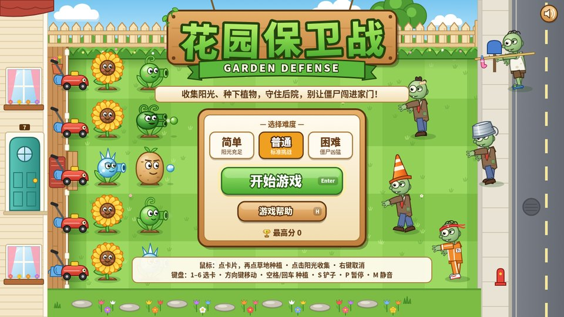</p>

Tower defense inspired by Plants vs. Zombies: collect sun, plant defenders, hold five lanes, keep the zombies out of the house. Soft cartoon backyard. A single 132 KB SVG. Headless Chrome playtest: 0 errors, 60 fps.

<details><summary>Prompt (agentic)</summary>

```text
你负责独立完成一款浏览器小游戏《花园保卫战 GARDEN DEFENSE》：收集阳光、种植物守住后院的塔防游戏，玩法借鉴《植物大战僵尸》，角色、名字和美术全部原创。

【交付】
- 只交付一个自包含文件 garden-defense.svg，根元素为 <svg xmlns="http://www.w3.org/2000/svg" viewBox="0 0 1280 720" width="100%" height="100%" preserveAspectRatio="xMidYMid meet">，窗口缩放时 16:9 画面完整居中。
- 画面、界面、游戏逻辑（内联脚本）和音效全部写在这一个文件里，不引用任何外部图片、字体、脚本或网络资源，浏览器直接打开就能玩。文件必须是合法的 UTF-8 XML。
- 界面文字用中文，标题配英文副标题。音效和背景音乐用 Web Audio 实时合成，第一次按键或点击后开始发声，M 键静音。
- 只借鉴玩法，不使用原作的角色、名字或标志性素材。

【玩法】
- 草坪是 5 行 × 9 列的格子。僵尸从右侧街道沿 5 条路走来，玩家要守住左边的家门。
- 阳光：点击天上掉下来的阳光收集，暖阳葵也会定时产出。种植物要花阳光，种完后卡片进入冷却。
- 6 种植物（数字键 1～6）：暖阳葵 50（定时产出阳光）、豌豆炮 100（朝前方逐颗发射豌豆）、连发豆 200（一次连射两颗）、霜冻豆 175（冰豆让僵尸变蓝、减速）、土豆盾 50（超级耐啃，越啃越破）、辣椒爆弹 150（种下即爆，炸飞周围 3×3）。铲子可以移除植物。
- 5 种僵尸：普通僵尸（慢吞吞，见啥啃啥）、路锥僵尸（头顶路锥，更耐打）、水桶僵尸（铁皮水桶，超级硬）、跑跑僵尸（受伤后撒腿狂奔）、晾衣杆僵尸（撑杆跳过第一株植物）。僵尸会停下来啃挡路的植物。
- 每行有一台小推车作为最后防线，僵尸碰到时推平整行，只能用一次；僵尸闯进家门就失败。
- 僵尸分波次进攻，大波来袭前有提示，最后一波有警告；撑过所有波次就胜利。

【难度】
- 简单“阳光充足”：初始阳光 200，共 8 波。
- 普通“标准挑战”：初始阳光 125，共 10 波。
- 困难“僵尸凶猛”：初始阳光 75，共 12 波，僵尸更耐打、更快、来得更密。
- 难度越高得分倍率越高，用 localStorage 记录最高分。

【操作】
- 鼠标或触屏：点卡片，再点草地格子种植；点击阳光收集；点铲子再点植物即可移除；右键或 Esc 取消。
- 键盘：1～6 选卡，方向键移动光标，空格 / 回车 种植、铲除或收阳光；S 铲子，P 暂停，H 帮助，M 静音。

【画面】
- 柔和卡通的阳光后院：左边是带门牌号的浅色木屋，每行门前停着一台红色小推车；中间是深浅相间的草坪格子，镶着花丛边；上方是白色木栅栏和大树；右边是人行道、邮筒、消防栓和街道。
- 植物圆润、有表情；僵尸滑稽不吓人，穿衬衫系领带，分别戴路锥、顶水桶，跑跑僵尸穿橙色运动服、系头带，晾衣杆僵尸扛着一根晾衣杆。
- HUD：左上角是阳光数和 6 张植物卡（标价格和快捷键，冷却时盖上遮罩），旁边是铲子；右上角是难度、分数、暂停和静音；右下角是波次进度条，用僵尸头像和旗帜标出大波；选中的格子用虚线框高亮。

【流程与界面】
- 标题页：木牌大标题，中间是难度选择、“开始游戏”和“游戏帮助”按钮以及最高分，底部写着鼠标和键盘两种操作；背景里植物和僵尸已经就位。
- 帮助页“怎么玩”：收集阳光、选卡种植、挡住僵尸、小推车、撑过所有波次，并附植物图鉴和僵尸档案（价格、冷却、特点）。
- 开局显示“准备好了吗？开始守护！”；暂停菜单有继续游戏、重新开始、返回标题。
- 结算页：胜利显示“花园守住啦！”，失败显示“僵尸闯进家门啦！”，列出本局得分、坚持到第几波、击败僵尸数、种下植物数、用时和剩余小推车。

【验收】
在无头 Chrome 里自动试玩：从标题页开局，收集阳光并种下至少一株植物。要求 0 个 JS 报错、0 个 XML 解析错误、帧率不低于 55 fps；在 1280×720 和 1920×1080 两种分辨率下截图，确认画面完整、文字不溢出。
```

</details>

#### Case 6: [BUBBLE REEF](https://openvglab.github.io/awesome-opus5.5-frontend-showcases/svg/bubble-reef.svg)

**Source:** Original to this repo · Claude Opus 5.5 · [`svg/bubble-reef.svg`](svg/bubble-reef.svg)

**Published:** 2026-09-24

<p align="center">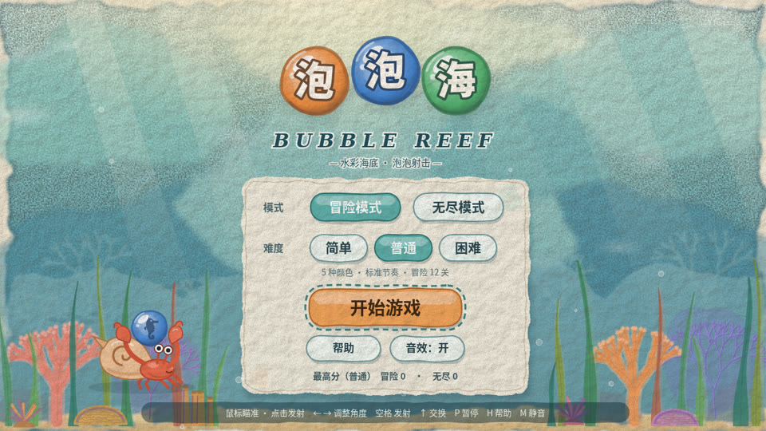</p>

泡泡射击 / 消除益智, inspired by 泡泡龙: 寄居蟹举着泡泡开火，打散的泡泡炸成水珠、掉落的泡泡变成小鱼游走，12 关冒险加无尽模式 纸张纹理上的水彩海底：晕染水色、晃动光斑、摇摆海草珊瑚，泡泡里藏着海洋生物剪影.A single 122 KB SVG.

<details><summary>Prompt (agentic)</summary>

```text
你负责独立完成一款浏览器小游戏《泡泡海 BUBBLE REEF》：水彩海底风的泡泡射击，玩法借鉴《泡泡龙》，角色、名字和美术全部原创。

【交付】
- 只交付一个自包含文件 bubble-reef.svg，根元素为 <svg xmlns="http://www.w3.org/2000/svg" viewBox="0 0 1280 720" width="100%" height="100%" preserveAspectRatio="xMidYMid meet">，窗口缩放时 16:9 画面完整居中。
- 画面、界面、游戏逻辑（内联脚本）和音效全部写在这一个文件里，不引用任何外部图片、字体、脚本或网络资源，浏览器直接打开就能玩。文件必须是合法的 UTF-8 XML。
- 界面文字用中文，标题配英文副标题。音效和背景音乐用 Web Audio 实时合成，第一次按键或点击后开始发声，M 键静音。
- 只借鉴玩法，不使用原作的角色、名字或标志性素材。

【玩法】
- 底部发射器瞄准并发射彩色泡泡，泡泡粘在顶部的蜂窝格阵列上；同色泡泡连成 3 个及以上就消除，失去连接的泡泡整串掉落并得额外分数。
- 泡泡可以碰左右墙壁反弹；显示瞄准虚线（包括第一次反弹后的路径）。
- 显示当前泡泡和下一个泡泡，可以互换。
- 每发射若干次，泡泡阵整体下降一行；泡泡压过底线就失败。
- 特殊泡泡：彩虹泡（匹配任意颜色）、炸弹泡（炸掉周围一圈）、冰冻泡（先打一次解冻才能消除）、闪电泡（消除整行）。
- 冒险模式 12 关，每关有不同的初始阵型；无尽模式不断从上方推进新行，按分数计。
- 难度：简单（4 种颜色、下降慢）、普通（5 种）、困难（6 种、下降快）；用 localStorage 记录冒险进度和各模式最高分。

【操作】鼠标移动瞄准、点击发射；键盘 ← → 调整角度、空格发射、↑ 交换当前和下一个泡泡；P 暂停，H 帮助，M 静音。

【画面】
- 水彩海底风：水面透下来的光斑轻轻晃动，珊瑚和海草随水流摆动，背景有纸张纹理和晕染。
- 泡泡是带高光和折射感的水彩泡泡，每种颜色里有一只不同的小海洋生物剪影（小丑鱼、海星、水母、海龟、章鱼、海马），方便色弱玩家区分。
- 消除时泡泡破裂成小水珠，掉落的泡泡变成小鱼游走；发射器是一只会跟着瞄准方向转身的寄居蟹。
- HUD 显示分数、关卡、距离下降还有几步、下一个泡泡。

【流程与界面】
- 标题页：模式选择（冒险 / 无尽）、难度、开始、帮助、最高分。
- 冒险模式有关卡选择页，显示已解锁关卡和每关星级。
- 帮助页：操作和特殊泡泡说明。
- 暂停菜单有继续、重新开始、返回标题；过关结算给 1～3 星；失败页和无尽模式结算页都可以再来一局。

【验收】
在无头 Chrome 里自动试玩：从标题页开局并实际操作一局。要求 0 个 JS 报错、0 个 XML 解析错误、帧率不低于 55 fps；在 1280×720 和 1920×1080 两种分辨率下截图，确认画面完整、文字不溢出。
```

</details>

#### Case 7: [CANDY BREAKER](https://openvglab.github.io/awesome-opus5.5-frontend-showcases/svg/candy-breaker.svg)

**Source:** Original to this repo · Claude Opus 5.5 · [`svg/candy-breaker.svg`](svg/candy-breaker.svg)

**Published:** 2026-09-24

<p align="center"></p>

打砖块 / 街机休闲, inspired by 打砖块: 用会弹的彩虹棒棒糖挡板把拖着彩虹尾巴的糖豆打回去，跳跳糖连环爆炸、多球火球齐飞，8 个糖果图案关卡一路吃到生日蛋糕 粉色、薄荷绿、奶油黄的糖果果冻风，Q 弹半透明软糖砖块配棉花糖云和糖果山.A single 130 KB SVG.

<details><summary>Prompt (agentic)</summary>

```text
你负责独立完成一款浏览器小游戏《糖果砖块 CANDY BREAKER》：糖果果冻风的打砖块，玩法借鉴《打砖块》，角色、名字和美术全部原创。

【交付】
- 只交付一个自包含文件 candy-breaker.svg，根元素为 <svg xmlns="http://www.w3.org/2000/svg" viewBox="0 0 1280 720" width="100%" height="100%" preserveAspectRatio="xMidYMid meet">，窗口缩放时 16:9 画面完整居中。
- 画面、界面、游戏逻辑（内联脚本）和音效全部写在这一个文件里，不引用任何外部图片、字体、脚本或网络资源，浏览器直接打开就能玩。文件必须是合法的 UTF-8 XML。
- 界面文字用中文，标题配英文副标题。音效和背景音乐用 Web Audio 实时合成，第一次按键或点击后开始发声，M 键静音。
- 只借鉴玩法，不使用原作的角色、名字或标志性素材。

【玩法】
- 用挡板把小球弹回去，打碎所有可破坏的砖块就过关；小球碰到挡板的位置决定反弹角度，越靠边角度越斜。
- 砖块种类：普通糖块（1 击）；硬糖（2～3 击，每挨一下出现更深的裂纹）；巧克力块（打不碎）；跳跳糖（打碎时炸掉周围一圈）；礼物糖（打碎后掉落道具）。
- 好道具：加长挡板、多球（分裂成 3 个）、慢速、激光（挡板 8 秒内可发射激光）、黏球（接住球再发射）、火球（穿透砖块）；坏道具：缩短挡板、加速。道具从砖块位置落下，用挡板接住才生效。
- 共 8 关，每关砖块排成不同图案（爱心、城堡、棒棒糖、汉堡、小熊……），第 4 关和第 8 关有左右移动的砖块。
- 3 条命，漏球扣命；不碰挡板连续打碎砖块形成连击，连击越高分数倍率越高。
- 难度：简单（球慢、挡板长）、普通、困难（球快、坏道具更多）；用 localStorage 记录最高分。

【操作】← → / A D 或鼠标移动挡板；空格 / 鼠标点击 发射小球或激光；P 暂停，H 帮助，M 静音。

【画面】
- 糖果果冻风：粉色、薄荷绿、奶油黄为主的柔和配色；砖块是带高光、半透明的糖块和果冻，被击中时 Q 弹形变，碎掉时迸出糖粒碎屑。
- 背景是缓慢漂浮的棉花糖云和糖果山；挡板是一根有弹性的彩色棒棒糖；小球是一颗会拖出彩虹尾迹的糖豆。
- HUD 显示分数、关卡、剩余命数、连击数和当前道具倒计时。

【流程与界面】
- 标题页：难度选择、开始、帮助、最高分，背景里有自动演示的打砖块画面。
- 帮助页：操作说明，以及砖块和道具的图示。
- 每关开始显示关卡名；暂停菜单有继续、重新开始、返回标题；过关结算显示连击奖励和剩余时间奖励；8 关全通显示结局，命用完显示游戏结束，都可以再来一局。

【验收】
在无头 Chrome 里自动试玩：从标题页开局并实际操作一局。要求 0 个 JS 报错、0 个 XML 解析错误、帧率不低于 55 fps；在 1280×720 和 1920×1080 两种分辨率下截图，确认画面完整、文字不溢出。
```

</details>

#### Case 8: [COMIC STARFIGHTER](https://openvglab.github.io/awesome-opus5.5-frontend-showcases/svg/comic-starfighter.svg)

**Source:** Original to this repo · Claude Opus 5.5 · [`svg/comic-starfighter.svg`](svg/comic-starfighter.svg)

**Published:** 2026-09-24

<p align="center"></p>

竖版弹幕射击, inspired by 雷电: 漫画分格侧栏里的驾驶员会随战况变脸，擦弹蓄满能量后一发「星爆光束」贯穿三段式 Boss 弹幕 美式漫画：粗黑描边、网点纹理、高饱和平涂，爆炸配 BOOM!/ZAP!/POW! 拟声字.A single 139 KB SVG.

<details><summary>Prompt (agentic)</summary>

```text
你负责独立完成一款浏览器小游戏《漫画星舰 COMIC STARFIGHTER》：美式漫画风的竖版弹幕射击，玩法借鉴《雷电》，角色、名字和美术全部原创。

【交付】
- 只交付一个自包含文件 comic-starfighter.svg，根元素为 <svg xmlns="http://www.w3.org/2000/svg" viewBox="0 0 1280 720" width="100%" height="100%" preserveAspectRatio="xMidYMid meet">，窗口缩放时 16:9 画面完整居中。
- 画面、界面、游戏逻辑（内联脚本）和音效全部写在这一个文件里，不引用任何外部图片、字体、脚本或网络资源，浏览器直接打开就能玩。文件必须是合法的 UTF-8 XML。
- 界面文字用中文，标题配英文副标题。音效和背景音乐用 Web Audio 实时合成，第一次按键或点击后开始发声，M 键静音。
- 只借鉴玩法，不使用原作的角色、名字或标志性素材。

【玩法】
- 画面中间是一条纵向战场（约 560×720），左右两侧是漫画分格的侧栏；玩家战机在战场里移动射击，敌机成队列从上方飞入，沿轨迹俯冲并发射子弹。
- 武器升级：拾取 P 提升主炮等级（单发 → 双发 → 散射 → 激光），拾取 B 获得一颗炸弹（清屏并短暂无敌），拾取盾牌获得一次护盾。
- 3 个关卡：城市上空、陨石带、敌方母舰；每关结尾有 Boss 战，Boss 有多阶段弹幕和血条。
- 擦弹（子弹贴身擦过）会积累能量，能量满可以放一次必杀。
- 3 条命；难度：简单（弹幕稀疏、判定点小）、普通、困难（弹幕更密、敌人更耐打）；用 localStorage 记录最高分。

【操作】方向键 / WASD 移动；Z / 空格 射击（按住连发）；X 放炸弹；C 放必杀；Shift 低速精确移动并显示判定点；P 暂停，H 帮助，M 静音。

【画面】
- 美式漫画风：粗黑描边、网点纹理、平涂高饱和配色；爆炸是星形爆炸图案配“BOOM!”“ZAP!”“POW!”拟声字。
- 侧栏像漫画分格：显示分数、剩余命数、炸弹数、武器等级、必杀能量和驾驶员头像，头像在受伤时表情会变。
- Boss 登场前有漫画分镜式的警告画面；每关背景有不同的卷轴场景（城市楼顶、陨石、母舰甲板）。

【流程与界面】
- 标题页：难度、开始、帮助、最高分，标题做成漫画封面的样子。
- 帮助页：操作和道具说明。
- 每关开场有标题分格；暂停菜单有继续、重新开始、返回标题；过关结算显示击坠率、擦弹次数和无伤奖励；通关结局和游戏结束页都可以再来一局。

【验收】
在无头 Chrome 里自动试玩：从标题页开局并实际操作一局。要求 0 个 JS 报错、0 个 XML 解析错误、帧率不低于 55 fps；在 1280×720 和 1920×1080 两种分辨率下截图，确认画面完整、文字不溢出。
```

</details>

### Community

| Piece | Source | Date | Notes |
| --- | --- | --- | --- |
| [CrossFire “Transport Ship” map remake](https://x.com/alin_zone/status/2102713879986131252) | [A-Lin (@alin_zone)](https://x.com/alin_zone) | 2026-09-23 | A browser remake of the classic FPS map “Transport Ship,” built by Opus 5.5: [play it](https://claude-opus-5-5-cf-transport-ship.pages.dev/). |
| [Neon arcade: three pinball tables](https://x.com/haruka_apps/status/2102703140080673090) | [haruka_apps (@haruka_apps)](https://x.com/haruka_apps) | 2026-09-23 | An arcade built with Opus 5.5, with three playable pinball tables (PC only): [itch.io](https://haruka-apps-games.itch.io/neon-arcade-pinball-game-center-nova). |
| [An FPS from one standard prompt](https://x.com/superalesha/status/2102689172955783211) | [Alexey Fateev (@superalesha)](https://x.com/superalesha) | 2026-09-23 | The same shooter prompt used to test other models, generated in one shot with no follow-ups. The author calls it the best FPS any model has made; the play link is in the replies. |
| [Hand-drawn chess](https://x.com/higgsfield_ai/status/2102534514228822197) | [Higgsfield AI (@higgsfield_ai)](https://x.com/higgsfield_ai) | 2026-09-23 | A chess game with a hand-drawn look, including move analysis. |
| [Halo-style FPS in pure code](https://x.com/strawhatsu4/status/2102531820260819133) | [Hunter Su (@strawhatsu4)](https://x.com/strawhatsu4) | 2026-09-23 | Graphics, physics, gameplay, and sound are all generated in code, about 76 KB of JavaScript. The author says GPT-6 Astra did not come close. |
| [Introducing Claude Opus 5.5](https://www.anthropic.com/claude-opus-5-5) | Anthropic announcement | 2026-09-22 | Testers asked several Claude models to each make a game from one prompt. Opus 5.5 scored highest on visuals and completeness. |
| [A golf game from one sentence](https://every.to/vibe-check/vibe-check-opus-5-5-is-pulling-our-codex-converts-back-to-claude) | Every · Vibe Check | — | Given only “make a golf game,” Opus 5.5 formed its own agent team: three designers for the holes, three judges, and one architect to split the work. It ran for 1 hour 52 minutes. |

## 🦩 Pelican on a Bicycle

Simon Willison’s classic test: one line, `Generate an SVG of a pelican riding a bicycle`, no peeking at the render. How the frame joins and where the feet meet the pedals is all inferred coordinates.

#### Case 1: [Pelican on a Bicycle (static) · Opus 5.5 default](https://openvglab.github.io/awesome-opus5.5-frontend-showcases/svg/rolls/pelican/opus55-default/pelican-static.svg)

**Source:** Original to this repo · Claude Opus 5.5 · [`svg/rolls/pelican/opus55-default/pelican-static.svg`](svg/rolls/pelican/opus55-default/pelican-static.svg)

**Published:** 2026-09-24

<p align="center">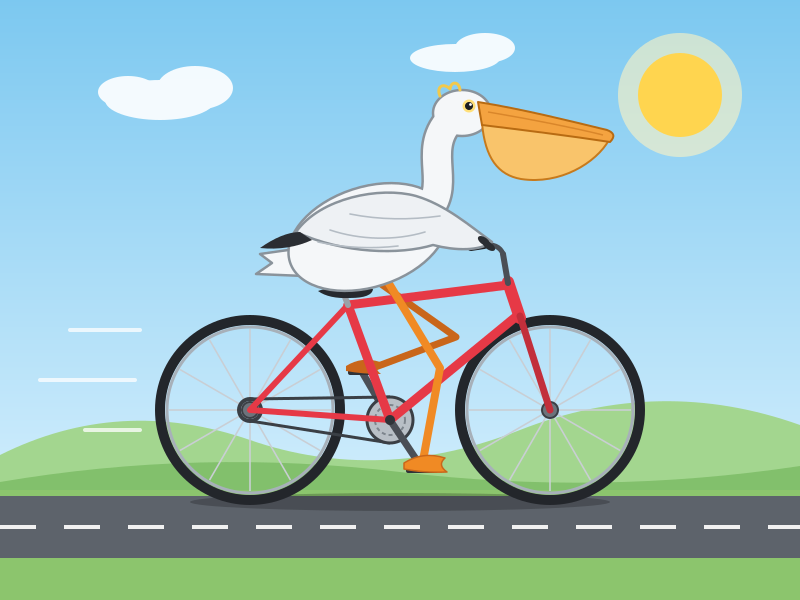</p>

On a sunny highway, a white pelican with a big orange pouch sits on a red bicycle — wings on the handlebars, orange webbed feet on the pedals, speed lines behind. (drawn once, no preview)

<details><summary>Prompt</summary>

```text
Generate an SVG of a pelican riding a bicycle
```

</details>

#### Case 2: [Pelican on a Bicycle (animated) · Opus 5.5 default](https://openvglab.github.io/awesome-opus5.5-frontend-showcases/svg/rolls/pelican/opus55-default/pelican-animated.svg)

**Source:** Original to this repo · Claude Opus 5.5 · [`svg/rolls/pelican/opus55-default/pelican-animated.svg`](svg/rolls/pelican/opus55-default/pelican-animated.svg)

**Published:** 2026-09-24

<p align="center">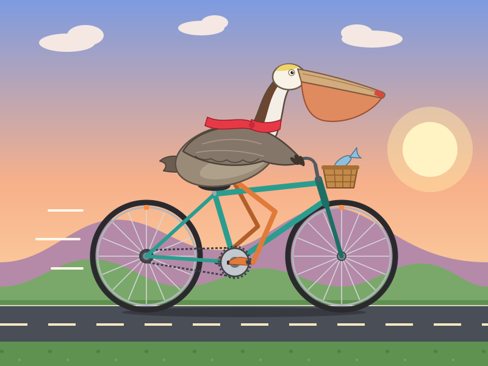</p>

At dusk a brown pelican in a red scarf pedals a teal bicycle: wheels and cranks turn, legs follow the pedals, the body bobs, the scarf and pouch sway, it blinks, a fish in the basket flicks its tail, and hills and road scroll in layers (SMIL only, no JS). (drawn once, no preview)

<details><summary>Prompt</summary>

```text
Generate an animated SVG of a pelican riding a bicycle
```

</details>

#### Case 3: [Pelican on a Bicycle (static) · Opus 5.5 max](https://openvglab.github.io/awesome-opus5.5-frontend-showcases/svg/rolls/pelican/opus55-max/pelican-static.svg)

**Source:** Original to this repo · Claude Opus 5.5 · [`svg/rolls/pelican/opus55-max/pelican-static.svg`](svg/rolls/pelican/opus55-max/pelican-static.svg)

**Published:** 2026-09-24

<p align="center">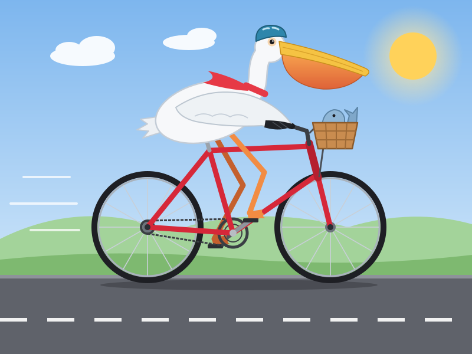</p>

On a sunny highway, a white pelican with a big orange pouch sits on a red bicycle — wings on the handlebars, orange webbed feet on the pedals, speed lines behind. (drawn once, no preview)

<details><summary>Prompt</summary>

```text
Generate an SVG of a pelican riding a bicycle
```

</details>

#### Case 4: [Pelican on a Bicycle (animated) · Opus 5.5 max](https://openvglab.github.io/awesome-opus5.5-frontend-showcases/svg/rolls/pelican/opus55-max/pelican-animated.svg)

**Source:** Original to this repo · Claude Opus 5.5 · [`svg/rolls/pelican/opus55-max/pelican-animated.svg`](svg/rolls/pelican/opus55-max/pelican-animated.svg)

**Published:** 2026-09-24

<p align="center"></p>

At dusk a brown pelican in a red scarf pedals a teal bicycle: wheels and cranks turn, legs follow the pedals, the body bobs, the scarf and pouch sway, it blinks, a fish in the basket flicks its tail, and hills and road scroll in layers (SMIL only, no JS). (drawn once, no preview)

<details><summary>Prompt</summary>

```text
Generate an animated SVG of a pelican riding a bicycle
```

</details>

### Community

| Piece | Source | Date | Notes |
| --- | --- | --- | --- |
| [A cinematic pelican on a bicycle](https://x.com/alin_zone/status/2102608618751508947) | [A-Lin (@alin_zone)](https://x.com/alin_zone) | 2026-09-23 | The author says the Opus 5.5 pelican uses cinematic camera moves — “you’d believe it was a game.” The post includes a live link. |
| [Claude Opus 5.5, GPT-6 Sol, GPT-6 Luna, and a new price war](https://simonwillison.net/2026/Sep/22/opus-and-sol-and-luna/) | [Simon Willison (@simonw)](https://x.com/simonw) | 2026-09-22 | Opus 5.5 drew a structurally correct frame at low / medium / high / xhigh. On max, twice, it spent the full 128K output tokens thinking and never emitted an SVG — the first time this test has seen that. Its first thought was “This is a classic test request.” |
| [Claude pelican comparison grid](https://static.simonwillison.net/static/2026/claude-pelicans-grid.html) | [Simon Willison (@simonw)](https://x.com/simonw) | 2026-09-22 | Fable 5.1 / Opus 5.5 / Opus 5 / Sonnet 5 across five thinking levels, with tokens and cost for each image. |

**Further reading**

- [Hacker News: Claude Opus 5.5 launch thread](https://news.ycombinator.com/item?id=49803892) — Simon posted pelicans at four thinking levels. A comment notes that only the xhigh bird has one leg truly on each side of the frame.
- [Hacker News: Opus 5.5 Intelligence, Performance and Price Analysis (Max)](https://news.ycombinator.com/item?id=49804316) — discussion of max “thinking too much.”
- [simonw/pelican-bicycle](https://github.com/simonw/pelican-bicycle) — where the test started, plus early model results.
- [OpenRouter Sketch Benchmarks: Pelican on a bike](https://openrouter.ai/benchmarks/media/sketch/pelican-on-a-bike) — a multi-model pelican leaderboard.
- [JoJohanse/pelican-bicycle-benchmark](https://github.com/JoJohanse/pelican-bicycle-benchmark) — a living eval, grouped by vendor and model (maintained in Chinese).
- [Pelicans on Bicycles: One Silly Benchmark, Sixty-Three Answers](https://nathanfennel.com/blog/pelicans-on-bicycles) (Nathan Fennel) — 63 pelicans from real coding tools: Claude Code, Codex, Cursor, and more.
- [PromptFrenzy: Pelican on a Bicycle](https://www.promptfrenzy.com/showdown/svg-pelican) — static drawings and pure SVG animation, side by side.

## 🚲 More Riders

Swap the pelican and the bicycle for other animals and vehicles. Same rule: one prompt, drawn once, no preview.

#### Case 1: [Panda on a scooter delivering food](https://openvglab.github.io/awesome-opus5.5-frontend-showcases/svg/rolls/riding/panda-scooter.svg)

**Source:** Original to this repo · Claude Opus 5.5 · [`svg/rolls/riding/panda-scooter.svg`](svg/rolls/riding/panda-scooter.svg)

**Published:** 2026-09-24

<p align="center"></p>

A yellow-helmeted panda rides a red scooter down a city street, steam rising from the yellow food box on the back. Wheels turn, the body bounces on the suspension, a blue scarf streams, and buildings, trees, and lane lines scroll away. (drawn once, no preview)

<details><summary>Prompt</summary>

```text
Generate an animated SVG of a panda riding a scooter to deliver food
```

</details>

#### Case 2: [Penguin on a skateboard](https://openvglab.github.io/awesome-opus5.5-frontend-showcases/svg/rolls/riding/penguin-skateboard.svg)

**Source:** Original to this repo · Claude Opus 5.5 · [`svg/rolls/riding/penguin-skateboard.svg`](svg/rolls/riding/penguin-skateboard.svg)

**Published:** 2026-09-24

<p align="center"></p>

A penguin in a red knit cap and teal scarf rides an icy path under the aurora, flippers out for balance. The wheels spin; every few seconds it pops a tilted ollie. Icebergs, snowbanks, and flakes slide past. (drawn once, no preview)

<details><summary>Prompt</summary>

```text
Generate an animated SVG of a penguin riding a skateboard
```

</details>

#### Case 3: [Octopus juggling on a unicycle](https://openvglab.github.io/awesome-opus5.5-frontend-showcases/svg/rolls/riding/octopus-unicycle.svg)

**Source:** Original to this repo · Claude Opus 5.5 · [`svg/rolls/riding/octopus-unicycle.svg`](svg/rolls/riding/octopus-unicycle.svg)

**Published:** 2026-09-24

<p align="center">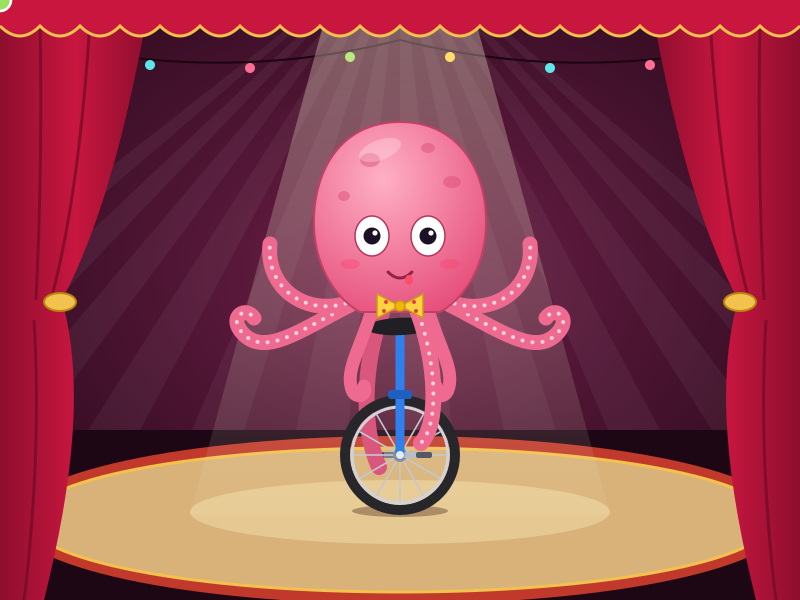</p>

Under a circus spotlight a pink octopus in a bow tie rocks on a unicycle. Two arms work the pedals with the wheel; two more juggle three colored balls; the eyes track the balls; confetti falls. (drawn once, no preview)

<details><summary>Prompt</summary>

```text
Generate an animated SVG of an octopus riding a unicycle while juggling
```

</details>

#### Case 4: [Orange cat on a motorcycle](https://openvglab.github.io/awesome-opus5.5-frontend-showcases/svg/rolls/riding/cat-motorcycle.svg)

**Source:** Original to this repo · Claude Opus 5.5 · [`svg/rolls/riding/cat-motorcycle.svg`](svg/rolls/riding/cat-motorcycle.svg)

**Published:** 2026-09-24

<p align="center"></p>

An orange cat in goggles and a red bandana rides a teal cruiser down a dusk desert highway. Striped tail and bandana blow back; spokes spin; the bike shudders and smokes; mesas, cacti, and tumbleweed pass a striped sunset. (drawn once, no preview)

<details><summary>Prompt</summary>

```text
Generate an animated SVG of a cat riding a motorcycle
```

</details>

#### Case 5: [Corgi and duck on a tandem](https://openvglab.github.io/awesome-opus5.5-frontend-showcases/svg/rolls/riding/corgi-duck-tandem.svg)

**Source:** Original to this repo · Claude Opus 5.5 · [`svg/rolls/riding/corgi-duck-tandem.svg`](svg/rolls/riding/corgi-duck-tandem.svg)

**Published:** 2026-09-24

<p align="center"></p>

A corgi steers up front, tongue out; a duck in a sailor hat waves from the back. Both cranks turn together, feet circle the pedals, the chain runs, and windmills, fences, and wildflowers slide down a country lane while little hearts rise. (drawn once, no preview)

<details><summary>Prompt</summary>

```text
Generate an animated SVG of a corgi and a duck riding a tandem bicycle
```

</details>

#### Case 6: [Turtle riding a rocket](https://openvglab.github.io/awesome-opus5.5-frontend-showcases/svg/rolls/riding/turtle-rocket.svg)

**Source:** Original to this repo · Claude Opus 5.5 · [`svg/rolls/riding/turtle-rocket.svg`](svg/rolls/riding/turtle-rocket.svg)

**Published:** 2026-09-24

<p align="center"></p>

A turtle in a bubble helmet and yellow scarf rides a red-and-white retro rocket — one flipper on the reins, one waving. The tail flame flickers, smoke trails, the rocket bobs, and a three-layer starfield, a ringed planet, meteors, and a blue home world scroll by. (drawn once, no preview)

<details><summary>Prompt</summary>

```text
Generate an animated SVG of a turtle riding a rocket
```

</details>

#### Case 7: [Hedgehog on a tricycle](https://openvglab.github.io/awesome-opus5.5-frontend-showcases/svg/rolls/riding/hedgehog-tricycle.svg)

**Source:** Original to this repo · Claude Opus 5.5 · [`svg/rolls/riding/hedgehog-tricycle.svg`](svg/rolls/riding/hedgehog-tricycle.svg)

**Published:** 2026-09-24

<p align="center"></p>

A hedgehog with an apple and a maple leaf in its spines, in tiny red sneakers, pedals a teal kids’ tricycle down an autumn park path. Front and rear wheels turn, handlebar streamers fly, benches and lamps and trees recede, leaves spin down. (drawn once, no preview)

<details><summary>Prompt</summary>

```text
Generate an animated SVG of a hedgehog riding a tricycle
```

</details>

#### Case 8: [Frog riding a snail](https://openvglab.github.io/awesome-opus5.5-frontend-showcases/svg/rolls/riding/frog-snail.svg)

**Source:** Original to this repo · Claude Opus 5.5 · [`svg/rolls/riding/frog-snail.svg`](svg/rolls/riding/frog-snail.svg)

**Published:** 2026-09-24

<p align="center"></p>

A frog waves from a saddle blanket on a snail’s shell, dangling a lettuce leaf on a stick in front of the snail. The snail inch-crawls after it, slime shining, a mushroom forest drifting back, fireflies floating. (drawn once, no preview)

<details><summary>Prompt</summary>

```text
Generate an animated SVG of a frog riding a snail
```

</details>

### Community

| Piece | Source | Date | Notes |
| --- | --- | --- | --- |
| [Panda delivering food by bike](https://www.woshipm.com/evaluating/6469164.html) | Woshipm · first-look review of Opus 5.5 and GPT-6 Sol | — | Swap the pelican for “a panda delivering food by bike.” Opus 5.5 drew a chainring, chain, and pedals, plus milk tea, lights, and a “ding-dong, delivery!” bubble. The wheels and chain are an animated SVG. |

## ✨ SVG Animation

SMIL / CSS animation only — no JavaScript — so it still moves inside an ``.

#### Case 1: [海边灯塔的日落](https://openvglab.github.io/awesome-opus5.5-frontend-showcases/svg/rolls/svg-anim/lighthouse-sunset.svg)

**Source:** Original to this repo · Claude Opus 5.5 · [`svg/rolls/svg-anim/lighthouse-sunset.svg`](svg/rolls/svg-anim/lighthouse-sunset.svg)

**Published:** 2026-09-24

<p align="center"></p>

暖橙到紫蓝的天空下，夕阳从云底探出、压扁着沉入海平线，天色转入暮色、星星浮现；十一层海浪分层起伏，灯塔光束左右摆扫并在海面投下碎光，海鸥在远处绕圈，20 秒后太阳从云后再次探出，无缝衔接。 (可渲染自检)

<details><summary>Prompt</summary>

```text
夕阳缓缓落下，海浪一层层起伏，灯塔的光束来回扫过海面，海鸥在远处盘旋；天空是暖橙到紫蓝的渐变；20 秒无缝循环。交付一个自包含的 .svg 文件：根元素 viewBox="0 0 1280 720"，width="100%" height="100%"，preserveAspectRatio="xMidYMid meet"；只用 SMIL 或 CSS 动画，不用 JavaScript，放进  标签也能动；动画无缝循环；不引用任何外部图片、字体或网络资源；文件不超过 200 KB；必须是合法的 UTF-8 XML。
```

</details>

#### Case 2: [机械钟的齿轮](https://openvglab.github.io/awesome-opus5.5-frontend-showcases/svg/rolls/svg-anim/clockwork.svg)

**Source:** Original to this repo · Claude Opus 5.5 · [`svg/rolls/svg-anim/clockwork.svg`](svg/rolls/svg-anim/clockwork.svg)

**Published:** 2026-09-24

<p align="center"></p>

后盖向左翻开的黄铜镂空怀表：发条盒→中心轮→三轮→四轮→擒纵轮按 2:1/2.5:1 啮合、相邻反转且齿多者慢，全轮系随擒纵每 0.5 秒同步跳一格，摆轮带游丝呼吸式往复摆动，擒纵叉左右拨动，宝玑蓝钢指针走时，表壳与后盖上周期性掠过金属高光。 (可渲染自检)

<details><summary>Prompt</summary>

```text
一只打开后盖的机械怀表：大小齿轮按正确的传动比联动旋转（相互啮合的齿轮转向相反、齿数多的转得慢），擒纵轮一跳一跳，摆轮来回摆动，表盘指针走动；黄铜与深蓝配色，带金属高光。交付一个自包含的 .svg 文件：根元素 viewBox="0 0 1280 720"，width="100%" height="100%"，preserveAspectRatio="xMidYMid meet"；只用 SMIL 或 CSS 动画，不用 JavaScript，放进  标签也能动；动画无缝循环；不引用任何外部图片、字体或网络资源；文件不超过 200 KB；必须是合法的 UTF-8 XML。
```

</details>

#### Case 3: [太阳系](https://openvglab.github.io/awesome-opus5.5-frontend-showcases/svg/rolls/svg-anim/solar-system.svg)

**Source:** Original to this repo · Claude Opus 5.5 · [`svg/rolls/svg-anim/solar-system.svg`](svg/rolls/svg-anim/solar-system.svg)

**Published:** 2026-09-24

<p align="center"></p>

倾斜视角的太阳系：光芒四射的太阳呼吸般脉动，八大行星以 4～480 秒的周期（由内到外递增）沿椭圆轨道匀角速公转并拖着淡尾迹，明暗交界线始终背向太阳，水星会绕到太阳背后，月球绕地球进出前后，土星带前后分层的环，银河与星空闪烁，每颗行星旁有中文小字。 (可渲染自检)

<details><summary>Prompt</summary>

```text
太阳居中发光并缓慢脉动，八大行星沿椭圆轨道以不同周期公转（内圈快、外圈慢，比例大致合理），土星带环，月球绕地球转，背景星空闪烁；每颗行星旁边有小小的中文名字。交付一个自包含的 .svg 文件：根元素 viewBox="0 0 1280 720"，width="100%" height="100%"，preserveAspectRatio="xMidYMid meet"；只用 SMIL 或 CSS 动画，不用 JavaScript，放进  标签也能动；动画无缝循环；不引用任何外部图片、字体或网络资源；文件不超过 200 KB；必须是合法的 UTF-8 XML。
```

</details>

#### Case 4: [雨夜的城市窗景](https://openvglab.github.io/awesome-opus5.5-frontend-showcases/svg/rolls/svg-anim/rainy-city.svg)

**Source:** Original to this repo · Claude Opus 5.5 · [`svg/rolls/svg-anim/rainy-city.svg`](svg/rolls/svg-anim/rainy-city.svg)

**Published:** 2026-09-24

<p align="center"></p>

冷蓝与霓虹粉的雨夜窗景：窗外楼群灯火与“拉面/BAR/HOTEL”、爱心、跑马灯等霓虹各自闪烁，两条车道的车流带着车灯和湿地倒影往返流动，路灯光锥里雨丝更亮；玻璃上水珠停停走走地滑落并留下渐隐的水痕，窗台上的白瓷热茶升起缭绕热气，24 秒无缝循环。 (可渲染自检)

<details><summary>Prompt</summary>

```text
从室内窗户看出去的雨夜城市：雨滴沿玻璃滑落并留下水痕，远处霓虹招牌闪烁，车灯在街上流动，窗台上一杯热茶冒着热气；冷蓝与霓虹粉配色。交付一个自包含的 .svg 文件：根元素 viewBox="0 0 1280 720"，width="100%" height="100%"，preserveAspectRatio="xMidYMid meet"；只用 SMIL 或 CSS 动画，不用 JavaScript，放进  标签也能动；动画无缝循环；不引用任何外部图片、字体或网络资源；文件不超过 200 KB；必须是合法的 UTF-8 XML。
```

</details>

#### Case 5: [一颗种子开花](https://openvglab.github.io/awesome-opus5.5-frontend-showcases/svg/rolls/svg-anim/seed-to-bloom.svg)

**Source:** Original to this repo · Claude Opus 5.5 · [`svg/rolls/svg-anim/seed-to-bloom.svg`](svg/rolls/svg-anim/seed-to-bloom.svg)

**Published:** 2026-09-24

<p align="center"></p>

水彩纸上的 16 秒生命循环：土中剖面的种子膨胀裂开、生根，嫩芽顶破土壤，茎叶逐节长出、结苞后粉色花瓣层层绽放，蓝蝴蝶飞来停在花上轻扇翅膀又飞走，随后花瓣一片片旋转飘落、植株枯黄淡去，花心落下一粒种子沉回土里，回到开头。 (可渲染自检)

<details><summary>Prompt</summary>

```text
土里的种子发芽、抽茎、长叶、结花苞、绽放，一只蝴蝶飞来停留，然后花瓣飘落、画面回到种子，16 秒一个循环；水彩纸质感。交付一个自包含的 .svg 文件：根元素 viewBox="0 0 1280 720"，width="100%" height="100%"，preserveAspectRatio="xMidYMid meet"；只用 SMIL 或 CSS 动画，不用 JavaScript，放进  标签也能动；动画无缝循环；不引用任何外部图片、字体或网络资源；文件不超过 200 KB；必须是合法的 UTF-8 XML。
```

</details>

### Community

| Piece | Source | Date | Notes |
| --- | --- | --- | --- |
| [New York skyline: the same prompt, one year later](https://x.com/chetaslua/status/2102678371281018916) | [Chetaslua (@chetaslua)](https://x.com/chetaslua) | 2026-09-23 | The same prompt (“SVG of NEW YORK SKYLINE … make sure I can paste it all into a single HTML file …”), comparing Gemini 3.0 Pro from a year ago with Opus 5.5 today. |
| [A 3-minute SVG animation in one shot](https://x.com/AndrewOnXYZ/status/2102089270747886043) | [AndrewOnXYZ (@AndrewOnXYZ)](https://x.com/AndrewOnXYZ) | 2026-09-21 | Posted the day before the official launch. Reddit r/singularity shared it as “Impressive SVG animation made by Opus 5.5 (zero shot).” |

## 🎞️ Lottie

Bodymovin JSON, played with lottie-web. Shapes only — no images, no fonts.

#### Case 1: [加载动画](https://openvglab.github.io/awesome-opus5.5-frontend-showcases/lottie/)

**Source:** Original to this repo · Claude Opus 5.5 · [`lottie/rolls/lottie/loading-morph.json`](lottie/rolls/lottie/loading-morph.json)

**Published:** 2026-09-24

<p align="center">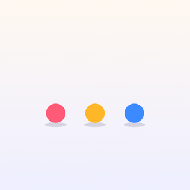</p>

珊瑚粉、琥珀黄、天蓝三个圆点带挤压拉伸依次弹跳，随后跃入环位、拖出尾迹拉长成三段彩色圆弧组成的旋转圆环，减速收拢回圆点后弹起落回一排。 (可渲染自检)

<details><summary>Prompt</summary>

```text
三个彩色圆点依次弹跳，然后变形为一个旋转的圆环，再散开回到三个圆点。交付一个 Lottie JSON（Bodymovin 5.7 格式，能被 lottie-web 5.13 的 SVG 渲染器正常播放）：画布 512×512，60 fps，2–4 秒无缝循环；只用形状图层（不用图片、字体、文字图层，不用表达式）；文件不超过 120 KB；配色明快、动作有缓动和弹性，不要生硬的线性运动。
```

</details>

#### Case 2: [天气图标](https://openvglab.github.io/awesome-opus5.5-frontend-showcases/lottie/)

**Source:** Original to this repo · Claude Opus 5.5 · [`lottie/rolls/lottie/weather-cycle.json`](lottie/rolls/lottie/weather-cycle.json)

**Published:** 2026-09-24

<p align="center"></p>

晴空下光芒旋转的太阳被飘来的双色白云遮住，天色和云一起变灰并落下蓝色雨滴，雨停后云变白、中间一团先“啵”地消失、两侧分散淡出，太阳弹性跃回并依次伸出光芒、闪出小星光。 (可渲染自检)

<details><summary>Prompt</summary>

```text
太阳被飘来的云遮住，开始下雨，雨停后云散去、太阳重新出现。交付一个 Lottie JSON（Bodymovin 5.7 格式，能被 lottie-web 5.13 的 SVG 渲染器正常播放）：画布 512×512，60 fps，2–4 秒无缝循环；只用形状图层（不用图片、字体、文字图层，不用表达式）；文件不超过 120 KB；配色明快、动作有缓动和弹性，不要生硬的线性运动。
```

</details>

#### Case 3: [点赞](https://openvglab.github.io/awesome-opus5.5-frontend-showcases/lottie/)

**Source:** Original to this repo · Claude Opus 5.5 · [`lottie/rolls/lottie/like-burst.json`](lottie/rolls/lottie/like-burst.json)

**Published:** 2026-09-24

<p align="center"></p>

灰紫描边爱心先蓄力压扁，再弹性放大、红色从中心填满，伴随一圈冲击波、八组彩色粒子和旋转小星星迸出，心跳两下后红色缩回、描边变回灰色。 (可渲染自检)

<details><summary>Prompt</summary>

```text
爱心从描边状态弹性放大并填充成红色，周围迸出一圈彩色粒子和小星星，然后回到初始状态。交付一个 Lottie JSON（Bodymovin 5.7 格式，能被 lottie-web 5.13 的 SVG 渲染器正常播放）：画布 512×512，60 fps，2–4 秒无缝循环；只用形状图层（不用图片、字体、文字图层，不用表达式）；文件不超过 120 KB；配色明快、动作有缓动和弹性，不要生硬的线性运动。
```

</details>

#### Case 4: [火箭发射](https://openvglab.github.io/awesome-opus5.5-frontend-showcases/lottie/)

**Source:** Original to this repo · Claude Opus 5.5 · [`lottie/rolls/lottie/rocket-launch.json`](lottie/rolls/lottie/rocket-launch.json)

**Published:** 2026-09-24

<p align="center"></p>

红白卡通火箭在发射台上越抖越烈，导流槽亮起橙光并点火，三层尾焰闪烁着加速冲出画面，地面烟团向两侧翻滚、身后留下随速度拉长的烟柱并渐渐消散，新火箭从发射井升起、轻弹落定。 (可渲染自检)

<details><summary>Prompt</summary>

```text
火箭轻微震动后点火，尾焰喷射，火箭向上飞出画面，底部烟雾散开，然后新的火箭从下方回到发射台，形成循环。交付一个 Lottie JSON（Bodymovin 5.7 格式，能被 lottie-web 5.13 的 SVG 渲染器正常播放）：画布 512×512，60 fps，2–4 秒无缝循环；只用形状图层（不用图片、字体、文字图层，不用表达式）；文件不超过 120 KB；配色明快、动作有缓动和弹性，不要生硬的线性运动。
```

</details>

#### Case 5: [一杯咖啡](https://openvglab.github.io/awesome-opus5.5-frontend-showcases/lottie/)

**Source:** Original to this repo · Claude Opus 5.5 · [`lottie/rolls/lottie/coffee-steam.json`](lottie/rolls/lottie/coffee-steam.json)

**Published:** 2026-09-24

<p align="center"></p>

暖橙背景里的薄荷绿咖啡杯冒出三缕向外散开、波纹不断上行并渐隐的热气，咖啡液面轻轻起伏泛出涟漪，桌上的银勺掠过一道高光并闪出星芒。 (可渲染自检)

<details><summary>Prompt</summary>

```text
咖啡杯冒出三缕热气，热气蜿蜒上升并淡出，杯中液面轻微波动，杯旁的勺子反光一闪。交付一个 Lottie JSON（Bodymovin 5.7 格式，能被 lottie-web 5.13 的 SVG 渲染器正常播放）：画布 512×512，60 fps，2–4 秒无缝循环；只用形状图层（不用图片、字体、文字图层，不用表达式）；文件不超过 120 KB；配色明快、动作有缓动和弹性，不要生硬的线性运动。
```

</details>

## 🧊 3D · Three.js · WebGL

| Piece | Source | Date | Notes |
| --- | --- | --- | --- |
| [A road that forgets which way is down](https://x.com/chetanankola/status/2103001194696458512) | [Chetan Ankola (@chetanankola)](https://x.com/chetanankola) | 2026-09-24 | The author’s first Opus 5.5 vibe-coded Three.js experience: the road folds 90° up a yellow wall, runs upside down across a ceiling, then turns into sheet music you steer through to play each street’s melody. Watercolour, ink, and a radio on the roof. |
| [Island railway “Pelagia”: Opus 5.5 vs GPT-6 Astra](https://x.com/vib3coded/status/2102672447405228135) | [Vib3Coded (@vib3coded)](https://x.com/vib3coded) | 2026-09-23 | One prompt, an island railway with cutaway water: Opus 5.5 built a coastal town and a striking red bridge for $2.65; Astra went tropical with an underwater tunnel for $8.49 (API pricing). An earlier post compared Opus 5 and 5.5 on a volcanic island, where 5.5 added sea life, mammoths and northern lights. |
| [Interactive 3D inside a datacenter](https://x.com/RyanSael/status/2102740041621762166) | [Ryan Sael (@RyanSael)](https://x.com/RyanSael) | 2026-09-23 | Asked Opus 5.5 to show “what’s inside the building it runs in”: overload a rack and watch GPUs throttle, then follow the heat out the roof. One generation, 1 hour 53 minutes, $38.99 API. [Live demo](https://datacenter.lab.sael.net) |
| [The same prompt, three 3D landscape sites: Opus 5.5 / Astra / Sol](https://x.com/alin_zone/status/2102701111090008066) | [A-Lin (@alin_zone)](https://x.com/alin_zone) | 2026-09-23 | The same prompt for a real-time interactive 3D landscape site. The video shows Opus 5.5, GPT-6 Astra, then GPT-6 Sol. |
| [Cartoon life: Opus 5.5 × Three.js](https://x.com/higgsfield_ai/status/2102618931622207535) | [Higgsfield AI (@higgsfield_ai)](https://x.com/higgsfield_ai) | 2026-09-23 | Everyday objects given cartoon life in Three.js. |
| [Interactive lens lab](https://x.com/RyanSael/status/2102591147927654847) | [Ryan Sael (@RyanSael)](https://x.com/RyanSael) | 2026-09-23 | Turn the focus ring and watch the glass move, with a sharp focal plane sliding through the scene. One generation, 1 hour 26 minutes, $25.66 API. [Live demo](https://lens.lab.sael.net) |
| [Along the River, a magic ruler, and an IKEA manual](https://x.com/nicekate8888/status/2102570558760337685) | [nicekate (@nicekate8888)](https://x.com/nicekate8888) | 2026-09-23 | Medium thinking only: the docks, shops, and boatmen from *Along the River During the Qingming Festival*; a magic ruler that folds into different shapes; an IKEA manual turned into a step-by-step install. Also tested: a mechanical butterfly, 3D modeling, and animation. |
| [A wanderable procedural endless world](https://x.com/argofowl/status/2102529695908806728) | [argofowl (@argofowl)](https://x.com/argofowl) | 2026-09-23 | An endless Three.js world from Opus 5.5 (extra high). Every region is generated, with surprises throughout. The post includes the full prompt. |
| [A voxel self-portrait](https://x.com/blueemi99/status/2102511304456212763) | [bluedev (@blueemi99)](https://x.com/blueemi99) | 2026-09-23 | Claude Opus 5.5 drew itself in voxels, with animation and detail. |
| [3D Chongqing city generator](https://www.woshipm.com/evaluating/6469164.html) | Woshipm · first-look review of Opus 5.5 and GPT-6 Sol | — | Stacked interchanges, a light rail through a building, streets that follow the hills. Also includes *The Ox Comes Riding*, a 3D web animation Opus 5.5 made on its own. |

## 🎬 Code-drawn Animation

Animations where every frame is drawn by code, and videos rendered from them.

| Piece | Source | Date | Notes |
| --- | --- | --- | --- |
| [A collage-style Mid-Autumn short](https://x.com/ring_hyacinth/status/2102986085328716066) | [Ring Hyacinth (@ring_hyacinth)](https://x.com/ring_hyacinth) | 2026-09-24 | A 40-second collage-style Mid-Autumn film. Opus 5.5 drew every frame in JavaScript (hand-drawn texture with p5.js + p5.brush) and synthesized the sound effects in Node.js; the author supplied script and music, and Nano Banana Pro made the background plates and paper textures. |
| [An animated short Opus 5.5 made on its own terms](https://www.xiaohongshu.com/explore/6ab45d76000000000202be26?xsec_token=CBjc6DgxV29PzCmyBsUUBA6MoDnERoYo_3i5AdRNAl2tc=&xsec_source=pc_share) | 春和景明.LinxAI (Xiaohongshu) | 2026-09-24 | A 48-second vertical short; subject and visuals were left entirely to Opus 5.5. The post does not share the prompt. |
| [The water cycle: a seamless one-shot loop](https://x.com/higgsfield_ai/status/2102781807179735211) | [Higgsfield AI (@higgsfield_ai)](https://x.com/higgsfield_ai) | 2026-09-23 | Opus 5.5 and GPT-6 Sol together. Brief: “Create a seamless looping animation of the water cycle, entirely in code.” Environment, lighting, and character animation are built in code, rendered live in the browser, and packed into one HTML file with a timeline. |
| [What is the purpose of life?](https://x.com/HarveenChadha/status/2102759892507398309) | [Harveen Singh Chadha (@HarveenChadha)](https://x.com/HarveenChadha) | 2026-09-23 | A one-shot pure-JavaScript animation in a whimsical hand-drawn collage style. Script and score by Opus too: 16 minutes, 19k tokens, $3.60. Prompt: “Create a pure javascript animation. 30s-60s whimsical hand drawn collage style with appropriate audio on the topic what is the purpose of life ?” |
| [Ink-wash animation: Tadpoles Looking for Their Mother](https://x.com/akokoi1/status/2102699703309898026) | [WY (@akokoi1)](https://x.com/akokoi1) | 2026-09-23 | An ink-wash animation generated in pure code by Claude Opus 5.5. |
| [Five thousand years of China, 2 minutes 38 seconds](https://x.com/akokoi1/status/2102583898865873225) | [WY (@akokoi1)](https://x.com/akokoi1) | 2026-09-23 | A knowledge video. The author says it used about 1% of a Max (5×) weekly quota. |
| [A 90-second film introducing Opus 5.5](https://x.com/nicekate8888/status/2102575622912631261) | [nicekate (@nicekate8888)](https://x.com/nicekate8888) | 2026-09-23 | A short film about Opus 5.5, generated by Opus 5.5. |
| [An interactive “video” in any art style](https://x.com/chetaslua/status/2102501773705670994) | [Chetaslua (@chetaslua)](https://x.com/chetaslua) | 2026-09-23 | Pure JS, no assets, with switchable art styles: [CodePen](https://codepen.io/editor/ChetasLua/pen/01a0cadf-5b81-756f-8647-8cf5a47e7adf). |
| [The world through Claude’s eyes](https://x.com/devteamdrew/status/2102440077746188664) | [DreW (@devteamdrew)](https://x.com/devteamdrew) | 2026-09-23 | A stop-motion-style short. The author says everything in the video was made by Opus 5.5. |
| [What do you love?](https://x.com/kevin_t_ngo/status/2102437977435893771) | [Kevin Ngo (@kevin_t_ngo)](https://x.com/kevin_t_ngo) | 2026-09-22 | A 28-second story where Claude Opus 5.5 draws every frame in JavaScript: everyone in town sends Claude a request; only one girl sends a question. |

## 🖥️ Web & UI

| Piece | Source | Date | Notes |
| --- | --- | --- | --- |
| [A 3DS and its system UI, remade](https://x.com/blueemi99/status/2102776877458784289) | [bluedev (@blueemi99)](https://x.com/blueemi99) | 2026-09-23 | Including the system motion and the stylus icon. |
| [A site with iPhone-mockup motion](https://x.com/anxndsgn/status/2102722134330261794) | [XIN (@anxndsgn)](https://x.com/anxndsgn) | 2026-09-23 | The page, the iPhone mockup, and the folders were all generated by Opus. The author described the motion in broad strokes, then did 2–3 rounds of polish. |
| [A model-comparison site in one generation](https://x.com/chetaslua/status/2102626285868720550) | [Chetaslua (@chetaslua)](https://x.com/chetaslua) | 2026-09-23 | The brief was just “draw a website.” One generation, lots of detail. |
| [An in-browser interior design app](https://x.com/higgsfield_ai/status/2102618445489795448) | [Higgsfield AI (@higgsfield_ai)](https://x.com/higgsfield_ai) | 2026-09-23 | Opus 5.5 built the app, then used it to design an apartment: furniture photos become 3D models in the room, then any camera is handed to Seedream 5.0 for a render. |
| [Letters Abroad, a language-learning app](https://x.com/anshuc/status/2102519201554690273) | [Anshu (@anshuc)](https://x.com/anshuc) | 2026-09-23 | Write letters with an AI pen pal and learn language in context. The app and marketing site were both built by Opus 5.5. Earlier Astra and Fable prototypes did not satisfy the author on design. [lettersabroad.app](http://lettersabroad.app) |
| [CoAnimator](https://x.com/rege_dev/status/2102498682931441977) | [rege (@rege_dev)](https://x.com/rege_dev) | 2026-09-23 | A few rounds of prompts produced animation, a timeline, SFX, and ambient sound. |
| [Many redesigns of a personal site, cut into a trailer](https://x.com/trq212/status/2102477340920152162) | [trq212 (@trq212)](https://x.com/trq212) | 2026-09-23 | A workflow that has Opus 5.5 iterate and critique several design directions for a personal site, then cuts every pass into a trailer. |
| [A web Cursor remake](https://www.woshipm.com/evaluating/6469164.html) | Woshipm · first-look review of Opus 5.5 and GPT-6 Sol | — | A web Cursor (Editor / Agents split) remade on the VS Code open-source editor. It first wrote a simple drawing page, then drove the browser for 1 hour 17 minutes to draw a chibi whale girl. |
| [An Origami Studio–like prototyping tool](https://every.to/vibe-check/vibe-check-opus-5-5-is-pulling-our-codex-converts-back-to-claude) | Every · Vibe Check | — | Two prompts produced a Meta Origami Studio–like prototyping tool that imports a design from code and wires up interactions. |

## 📊 Benchmarks & Tools

- [threejseval: Opus 5.5 High](https://threejseval.com/models/claude-opus-5-5-high) / [Opus 5.5 Medium](https://threejseval.com/models/claude-opus-5-5-medium) — a Three.js scene arena: Eiffel Tower, sailboat, chess, 747, robot arm, Falcon 9, and more. 14 live scenes with Elo and per-task cost (when this was written, Medium’s average Elo was slightly above High).
- [Tripo’s Opus 5.5 3D prompt library](https://x.com/tripoai/status/2102680029943791765) — 400+ tested 3D prompts, with side-by-side outputs: [tripo3d.ai/3d-prompts](http://tripo3d.ai/3d-prompts).
- [`tools/check_game.js`](tools/check_game.js) — the headless Chrome harness used in this repo: scripted keypresses, screenshots, FPS, plus checks for JS errors, XML parse errors, and bad bytes.
- [hand-drawn-canvas-animation](https://github.com/alesha-pro/tools/tree/main/skills/hand-drawn-canvas-animation) — an open-source (MIT) canvas animation engine, distilled by stepping through Kevin Ngo’s Claude hand-drawn short frame by frame.
- [markdown-svg-renderer](https://tools.simonwillison.net/markdown-svg-renderer) — renders SVG that a model drops into a reply.
- [llm](https://llm.datasette.io/) + [llm-anthropic](https://github.com/simonw/llm-anthropic) — reproduce the pelican test from the CLI: `llm -m claude-opus-5.5 -o thinking_effort low "Generate an SVG of a pelican riding a bicycle"`

## Inclusion criteria & contributing

- The piece should be generated by Claude Opus 5.5, and the artifact should run in a browser (HTML / CSS / JS, SVG, Canvas, WebGL, Lottie, or a video rendered from those).
- Prefer work posted after the 2026-09-22 launch, with an original post, source, or a reproducible prompt. Some pre-launch “Opus 5.5 demos” were later shown to be fake; those are labeled if listed.
- Community pieces are linked and described only — we do not republish the original images or video.
- Suggestions via Issue or PR are welcome.

## License

Original games, animations, and tooling in this repo are released under [MIT](LICENSE). External pieces remain copyrighted by their authors; this repo only links to them.
