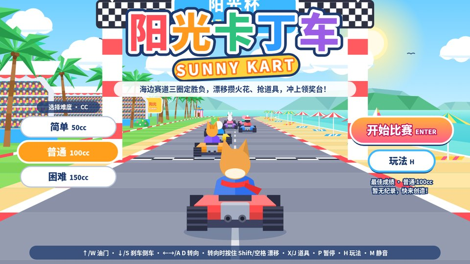
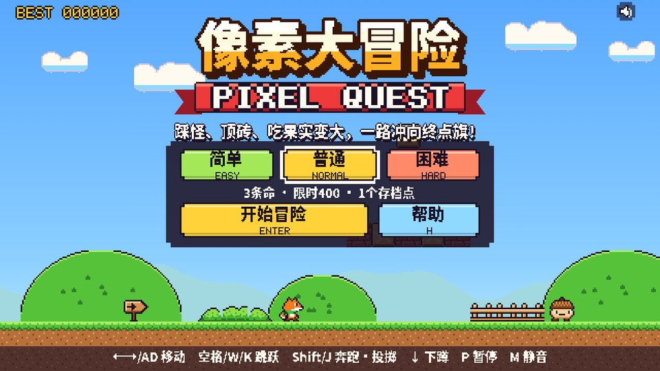

# Awesome Opus 5.5 Frontend Showcases

> 收集 Claude Opus 5.5（2026-09-22 发布）做出来的前端作品：SVG 游戏与动画、「鹈鹕骑自行车」系列、Lottie、Three.js / WebGL、代码逐帧动画、网页与 UI——凡是模型写代码、在浏览器里跑出来的，都在这里。
>
> A curated list of frontend showcases built by Claude Opus 5.5 — SVG games and animation, the pelican-on-a-bicycle family, Lottie, Three.js / WebGL, code-drawn video, websites and UI.

**在线游玩本仓库的作品 / Play online:** https://yiyingyang12.github.io/awesome-opus5.5-frontend-showcases/

## Contents

每个类别里，本仓库原创的作品排在前面并附完整 prompt，社区作品按发布时间倒序排列。

- 🎮 [浏览器游戏 · Games](#-浏览器游戏--games) — 12 cases
- 🦩 [鹈鹕骑自行车 · Pelican on a Bicycle](#-鹈鹕骑自行车--pelican-on-a-bicycle) — 3 cases
- 🚲 [更多骑行系列 · More Riders](#-更多骑行系列--more-riders) — 1 cases
- ✨ [SVG 动画与插画 · SVG Animation](#-svg-动画与插画--svg-animation) — 2 cases
- 🧊 [3D · Three.js · WebGL](#-3d--threejs--webgl) — 8 cases
- 🎬 [代码逐帧动画与视频 · Code-drawn Animation](#-代码逐帧动画与视频--code-drawn-animation) — 8 cases
- 🖥️ [网页、UI 与应用 · Web & UI](#-网页ui-与应用--web--ui) — 9 cases
- 📊 [评测与工具 · Benchmarks & Tools](#-评测与工具--benchmarks--tools)
- [收录标准与贡献](#收录标准与贡献)

## 🎮 浏览器游戏 · Games

纯 SVG 或网页里跑的游戏。本仓库的每款都是一个自包含的 `.svg` 文件：画面、界面、逻辑和实时合成的音效都在同一个文件里。

#### Case 1: [厨房大作战 KITCHEN RUSH](https://yiyingyang12.github.io/awesome-opus5.5-frontend-showcases/games/kitchen-rush.svg)

**来源：** 本仓库原创 · Claude Opus 5.5 · [`games/kitchen-rush.svg`](games/kitchen-rush.svg)

**发布：** 2026-09-24

<p align="center"></p>

俯视角合作烹饪，灵感来自《胡闹厨房》：切菜、下锅、装盘、出餐，在订单超时前把菜端上桌，支持同一键盘双人合作。俯视卡通、粗描边暖色调。单个 SVG 94 KB，无头 Chrome 自动试玩 0 报错、60 fps。

<details><summary>Prompt（Agentic 生成）</summary>

```text
你负责独立完成一款浏览器小游戏《厨房大作战 KITCHEN RUSH》：俯视角合作烹饪，玩法借鉴《胡闹厨房》，角色、名字和美术全部原创。

【交付】
- 只交付一个自包含文件 kitchen-rush.svg，根元素为 <svg xmlns="http://www.w3.org/2000/svg" viewBox="0 0 1280 720" width="100%" height="100%" preserveAspectRatio="xMidYMid meet">，窗口缩放时 16:9 画面完整居中。
- 画面、界面、游戏逻辑（内联脚本）和音效全部写在这一个文件里，不引用任何外部图片、字体、脚本或网络资源，浏览器直接打开就能玩。文件必须是合法的 UTF-8 XML。
- 界面文字用中文，标题配英文副标题。音效和背景音乐用 Web Audio 实时合成，第一次按键或点击后开始发声，M 键静音。
- 只借鉴玩法，不使用原作的角色、名字或标志性素材。

【玩法】
- 每局营业 2 分 30 秒。订单小票依次出现在左上角，每张都有倒计时，要在超时前把菜做好送到出餐口。
- 做菜流程：从食材箱拿食材 → 在砧板上按住切菜键切好 → 下锅煮或下锅煎 → 装进盘子 → 送到出餐口。
- 三道菜：番茄汤（3 个切好的番茄放进锅里煮）；蔬菜沙拉（切好的生菜 + 切好的番茄）；汉堡（面包 + 煎好的肉饼 + 切好的生菜）。
- 出餐越快小费越多；订单超时扣分；汤和肉饼放太久会烧焦，只能倒进垃圾桶；端错菜会被退回。每个无效操作都要有简短提示，比如“番茄要先切”“锅满了”“要先装盘”。
- 单人模式同时拥有两位厨师，用 Tab 切换控制；双人模式两人在同一键盘上合作。
- 营业结束按得分给 1～3 星，并用 localStorage 记录最佳成绩。

【厨房（选厨房 = 选难度）】
- 简单「街角小馆」：番茄汤、蔬菜沙拉，订单少、节奏慢。
- 普通「汉堡快餐」：蔬菜沙拉、汉堡。
- 困难「忙碌后厨」：三道菜全上，同时最多 5 张订单，食物更快烧焦，还有推车在过道里来回穿行挡路。

【操作】
- 单人：WASD / 方向键 移动，空格 / J 拿起或放下，按住 K 切菜，Shift 冲刺，Tab 换厨师。
- 双人：1P 用 WASD 移动、F 拿放、G 切菜、左 Shift 冲刺；2P 用方向键移动、句号键拿放、斜杠键切菜、右 Shift 冲刺（也可以用小键盘 1 / 2 / 0）。
- P / Esc 暂停，H 帮助，M 静音。

【画面】
- 俯视卡通厨房，粗描边、暖色调：红白格子桌布作背景，木质台面，米色棋盘格地砖，灶台上放着锅。
- 两位原创厨师戴白色高帽，1P 系红围巾，2P 系蓝围巾，走路有弹跳感；当前控制的厨师脚下显示高亮圈和 1P / 2P 标签。
- HUD：左上角是订单小票（菜品图示 + 剩余时间条），顶部中间是闹钟造型的营业倒计时，右上角是金币得分和星级进度，左侧一栏列出当前模式的按键。
- 反馈：切菜进度条、锅里冒泡、快烧焦时闪烁警告、烧焦时震屏，出餐时飘出得分和小费。

【流程与界面】
- 标题页：左边选模式（单人 1P / 双人 2P），中间三张厨房卡片，右边“开始”和“帮助”按钮；方向键选择，Enter 开始，并显示最佳成绩。
- 帮助页“怎么玩”：做菜流程、三道菜配方、单人和双人两套按键，以及计分规则。
- 开局显示“准备…开工！”；暂停菜单有继续、重新开始、返回标题，暂停时锅里的菜也停住。
- 结算页“打烊啦！”：出餐数、小费、超时、烧焦、端错次数，以及得分和星级，可以再来一局。

【验收】
在无头 Chrome 里自动试玩：从标题页开局，实际做出至少一道菜并出餐。要求 0 个 JS 报错、0 个 XML 解析错误、帧率不低于 55 fps；在 1280×720 和 1920×1080 两种分辨率下截图，确认画面完整、文字不溢出。
```

</details>

#### Case 2: [阳光卡丁车 SUNNY KART](https://yiyingyang12.github.io/awesome-opus5.5-frontend-showcases/games/sunny-kart.svg)

**来源：** 本仓库原创 · Claude Opus 5.5 · [`games/sunny-kart.svg`](games/sunny-kart.svg)

**发布：** 2026-09-24

<p align="center"></p>

伪 3D 卡丁车竞速，灵感来自《马力欧卡丁车》：海边赛道三圈定胜负，漂移攒火花、抢道具，和 7 位 AI 对手争夺领奖台。白天海岸、明亮低多边形。单个 SVG 130 KB，无头 Chrome 自动试玩 0 报错、60 fps。

<details><summary>Prompt（Agentic 生成）</summary>

```text
你负责独立完成一款浏览器小游戏《阳光卡丁车 SUNNY KART》：海边赛道上的伪 3D 卡丁车竞速，玩法借鉴《马力欧卡丁车》，角色、名字和美术全部原创。

【交付】
- 只交付一个自包含文件 sunny-kart.svg，根元素为 <svg xmlns="http://www.w3.org/2000/svg" viewBox="0 0 1280 720" width="100%" height="100%" preserveAspectRatio="xMidYMid meet">，窗口缩放时 16:9 画面完整居中。
- 画面、界面、游戏逻辑（内联脚本）和音效全部写在这一个文件里，不引用任何外部图片、字体、脚本或网络资源，浏览器直接打开就能玩。文件必须是合法的 UTF-8 XML。
- 界面文字用中文，标题配英文副标题。音效和背景音乐用 Web Audio 实时合成，第一次按键或点击后开始发声，M 键静音。
- 只借鉴玩法，不使用原作的角色、名字或标志性素材。

【玩法】
- 赛事叫「阳光杯」：玩家驾驶柴犬豆豆，在海边赛道上和 7 位 AI 对手跑 3 圈，按圈数和赛道进度实时排名，前三名登上领奖台。
- 起跑：三盏红灯依次亮起，第三盏亮起时按住油门能获得起步加速，踩得太早会提示“油门踩太早啦”。
- 漂移：转向时按住漂移键，车轮后的火花按蓝、橙、紫三级变亮，按得越久火花越亮，松开时获得对应强度的加速。
- 道具：撞碎赛道上的彩虹道具箱，随机获得一种——火箭冲刺（瞬间冲刺，沙地也不减速）、香蕉皮（丢在身后，踩到的车打滑转圈）、泡泡护盾（挡下一次香蕉皮或弹弹球）、弹弹球（向前弹出，追着前车跑）。AI 对手也会用道具。
- 赛道：压过橙色加速带会冲刺；开到沙地和草地会减速；开反方向时提示“逆行！”；进入最后一圈有提示。
- 8 位原创动物车手：柴犬豆豆、橘猫阿橙、小鸭嘎嘎、青蛙呱呱、企鹅波波、兔子跳跳、小猪噜噜、熊猫团团。

【难度】
- 简单 50cc / 普通 100cc / 困难 150cc，cc 越高车速越快、对手越强。
- 每档用 localStorage 记录最好名次和最佳用时。

【操作】
↑ / W 油门，↓ / S 刹车和倒车，← → / A D 转向，转向时按住 Shift 或空格漂移，X / J 使用道具，P 暂停，H 玩法，M 静音。

【画面】
- 白天海岸，明亮的低多边形伪 3D：公路按分段投影绘制，随弯道和坡度延伸到远处，两侧是红白路肩；路边有椰子树、观众看台、遮阳伞、灯塔和帆船，远景是海面、低多边形远山、太阳、白云和海鸥；起点是棋盘格拱门。
- 从车后视角呈现玩家的卡丁车，转向时车身倾斜，漂移时车轮后冒出彩色火花。
- HUD：左上角是道具槽、“LAP 1/3”圈数和用时；右侧是 8 位车手的实时名次表；左下角是赛道小地图；右下角用大字显示当前名次（如“8th 第8名”）；右上角有暂停和静音按钮。

【流程与界面】
- 标题页：棋盘格拱门下的赛道场景配大标题，左边选 cc，右边是“开始比赛”和“玩法”按钮，并显示该难度的最佳成绩。
- 玩法说明：操作、漂移火花、道具图鉴和比赛规则。
- 暂停菜单：继续比赛、重新开始、返回标题。
- 比赛结果：名次表、总时间、★最快圈和最佳纪录；拿到冠军时显示“冠军！阳光杯归你啦！”，可以再来一局。

【验收】
在无头 Chrome 里自动试玩：从标题页开赛，按住油门并转向跑完一段。要求 0 个 JS 报错、0 个 XML 解析错误、帧率不低于 55 fps；在 1280×720 和 1920×1080 两种分辨率下截图，确认画面完整、文字不溢出。
```

</details>

#### Case 3: [像素大冒险 PIXEL QUEST](https://yiyingyang12.github.io/awesome-opus5.5-frontend-showcases/games/pixel-quest.svg)

**来源：** 本仓库原创 · Claude Opus 5.5 · [`games/pixel-quest.svg`](games/pixel-quest.svg)

**发布：** 2026-09-24

<p align="center"></p>

横版平台跳跃，灵感来自《超级马里奥》：踩怪、顶砖、吃果实变大，穿过草原、洞穴和云端三个关卡冲向终点旗。8/16-bit 像素风，自绘像素字体。单个 SVG 145 KB，无头 Chrome 自动试玩 0 报错、60 fps。

<details><summary>Prompt（Agentic 生成）</summary>

```text
你负责独立完成一款浏览器小游戏《像素大冒险 PIXEL QUEST》：8/16-bit 像素风横版平台跳跃，玩法借鉴《超级马里奥》，角色、名字和美术全部原创。

【交付】
- 只交付一个自包含文件 pixel-quest.svg，根元素为 <svg xmlns="http://www.w3.org/2000/svg" viewBox="0 0 1280 720" width="100%" height="100%" preserveAspectRatio="xMidYMid meet">，窗口缩放时 16:9 画面完整居中。
- 画面、界面、游戏逻辑（内联脚本）和音效全部写在这一个文件里，不引用任何外部图片、字体、脚本或网络资源，浏览器直接打开就能玩。文件必须是合法的 UTF-8 XML。
- 界面文字用中文，标题配英文副标题。音效和背景音乐用 Web Audio 实时合成，第一次按键或点击后开始发声，M 键静音。
- 只借鉴玩法，不使用原作的角色、名字或标志性素材。

【玩法】
- 主角是一只小狐狸，依次穿过 3 个关卡：晴空草原、幽光洞穴、秋枫天桥，最后找到天桥尽头的小屋。
- 按住跳键跳得更高，按住奔跑键跑得更快、跳得更远。
- 踩怪、顶砖：从下方顶星星砖会顶出宝物；吃到浆果会变大，变大后能顶碎砖块；拿到金叶后可以用 J / Shift 投掷叶镖。
- 敌人：橡果兵（踩扁它）、刺猬（不能踩）、甲虫（踩成壳后可以踢出去）、蜜蜂（波浪飞行）、松果弹（可以踩）。
- 收集金币，每 100 枚奖励 1 条命；下蹲能钻进树洞，通往秘密房间；关卡里设有存档点；时间快用完时给出提醒。
- 终点旗抓得越高分越多，剩余时间换算成时间奖励；记录最高分，打破时提示“新纪录！”。

【难度】
- 简单：5 条命，限时 500，3 个存档点。
- 普通：3 条命，限时 400，1 个存档点。
- 困难：3 条命，限时 300，没有存档点，怪物更快。

【操作】
← → / A D 移动，空格 / W / K 跳跃（按住跳得更高），Shift / J 奔跑或投掷叶镖，↓ 下蹲或钻进树洞，P 暂停，H 帮助，M 静音。

【画面】
- 所有角色、图块和特效都按像素网格绘制，边缘保持锐利；界面文字也用自绘的像素字体。
- 晴空草原：蓝天白云、圆润的绿色山丘、木栅栏和指路牌；幽光洞穴：幽暗的岩洞里有发光的元素；秋枫天桥：云端之上的红枫色调。
- HUD：顶部一条像素信息栏，依次是 SCORE、金币数、WORLD 编号、TIME 倒计时和狐狸头像的剩余命数，右上角有暂停和静音按钮。

【流程与界面】
- 标题页：像素大标题配“PIXEL QUEST”红色横幅，三档难度按钮下方写明命数、限时和存档点，“开始冒险”（Enter）和“帮助”（H）按钮，左上角显示最高分；背景是草原，小狐狸和橡果兵站在地面上。
- 帮助页“冒险指南”：操作、规则，以及每种敌人和道具的图示说明。
- 暂停菜单：继续、帮助、返回标题。
- 每关结束显示过关和时间奖励；三关全部打完显示“全部通关！”结局，失败显示“游戏结束”，两者都列出分数、金币、击败数、用时和最高分。

【验收】
在无头 Chrome 里自动试玩：从标题页开始，向右跑、跳跃并踩扁至少一个敌人。要求 0 个 JS 报错、0 个 XML 解析错误、帧率不低于 55 fps；在 1280×720 和 1920×1080 两种分辨率下截图，确认画面完整、像素边缘清晰。
```

</details>

#### Case 4: [水果刀客 FRUIT SLASH](https://yiyingyang12.github.io/awesome-opus5.5-frontend-showcases/games/fruit-slash.svg)

**来源：** 本仓库原创 · Claude Opus 5.5 · [`games/fruit-slash.svg`](games/fruit-slash.svg)

**发布：** 2026-09-24

<p align="center"></p>

划动切水果，灵感来自《水果忍者》：挥动鼠标化作刀光切开满天水果，别碰炸弹；经典 / 街机 60 秒 / 禅意 90 秒三种模式。木纹道场、光泽水果与果汁飞溅。单个 SVG 159 KB，无头 Chrome 自动试玩 0 报错、60 fps。

<details><summary>Prompt（Agentic 生成）</summary>

```text
你负责独立完成一款浏览器小游戏《水果刀客 FRUIT SLASH》：用鼠标或手指划动切水果，玩法借鉴《水果忍者》，角色、名字和美术全部原创。

【交付】
- 只交付一个自包含文件 fruit-slash.svg，根元素为 <svg xmlns="http://www.w3.org/2000/svg" viewBox="0 0 1280 720" width="100%" height="100%" preserveAspectRatio="xMidYMid meet">，窗口缩放时 16:9 画面完整居中。
- 画面、界面、游戏逻辑（内联脚本）和音效全部写在这一个文件里，不引用任何外部图片、字体、脚本或网络资源，浏览器直接打开就能玩。文件必须是合法的 UTF-8 XML。
- 界面文字用中文，标题配英文副标题。音效和背景音乐用 Web Audio 实时合成，第一次按键或点击后开始发声，M 键静音。
- 只借鉴玩法，不使用原作的角色、名字或标志性素材。

【玩法】
- 水果从画面下方抛起，按住鼠标（或手指）快速划过就能切开；划得太慢切不开。
- 一刀切开 3 个以上水果得连击奖励；从正中快速切开有机会暴击 +10；连续切中会累积“连斩”。
- 千万别碰黑色炸弹。
- 三种模式：
  经典：3 条命，漏掉 3 个水果或碰到炸弹就结束。
  街机 60 秒：会出现特殊香蕉，切开后分别触发冰冻减速、双倍得分、狂热果潮；碰到炸弹扣 10 分。
  禅意 90 秒：没有炸弹，静心切果。
- 三档难度（简单、普通、困难），每个模式用 localStorage 各自记录最高分。

【操作】
- 鼠标或触屏划动切水果；在标题页切开某个模式圆环里的水果，就直接开始该模式。
- 键盘：← → 选模式，↑ ↓ 选难度，Enter 开始；P 暂停，R 重新开始，H 帮助，Esc 返回标题，M 静音。

【画面】
- 深色木纹道场：横向木板墙上有钉子和木节，上方挂着写有“切”“果”的红灯笼；标题是钉在木板上的宣纸牌匾，毛笔字“水果刀客”压着一道红色刀痕，旁边盖着“刀客”印章。
- 西瓜、苹果、菠萝、桃子等水果有光泽和立体感，切开后分成两半，露出果肉截面；果汁四溅，在木板上留下果渍。
- 刀光拖尾随划动速度变粗变亮，快速划动时有破空声；碰到炸弹有明显的爆炸效果。
- HUD：左上角是西瓜图标、得分和最高分；顶部中间显示“模式 · 难度”；经典模式在右上角用 3 个 ✕ 记录失误；右下角有暂停和静音按钮。

【流程与界面】
- 标题页：三个模式各是一个圆环，环里放一个水果（经典是西瓜，街机是菠萝，禅意是桃子），下面写模式规则和最高分；底部是帮助按钮、难度选择和“开始”按钮。
- 帮助页“刀客心法”：划切、连击、炸弹、失误、特殊香蕉和各模式说明。
- 开局有“预备”倒计时；暂停菜单有继续游戏、重新开始、操作说明、返回标题。
- 结算页：得分、切开水果数、最佳连击、最长连斩、命中率和本模式最高分，破纪录时提示“新纪录”。

【验收】
在无头 Chrome 里自动试玩：从标题页开局，用模拟的鼠标划动切开水果。要求 0 个 JS 报错、0 个 XML 解析错误、帧率不低于 55 fps；在 1280×720 和 1920×1080 两种分辨率下截图，确认画面完整、文字不溢出。
```

</details>

#### Case 5: [花园保卫战 GARDEN DEFENSE](https://yiyingyang12.github.io/awesome-opus5.5-frontend-showcases/games/garden-defense.svg)

**来源：** 本仓库原创 · Claude Opus 5.5 · [`games/garden-defense.svg`](games/garden-defense.svg)

**发布：** 2026-09-24

<p align="center"></p>

塔防，灵感来自《植物大战僵尸》：收集阳光、种下植物，守住 5 条路，别让僵尸闯进家门。柔和卡通、阳光后院。单个 SVG 132 KB，无头 Chrome 自动试玩 0 报错、60 fps。

<details><summary>Prompt（Agentic 生成）</summary>

```text
你负责独立完成一款浏览器小游戏《花园保卫战 GARDEN DEFENSE》：收集阳光、种植物守住后院的塔防游戏，玩法借鉴《植物大战僵尸》，角色、名字和美术全部原创。

【交付】
- 只交付一个自包含文件 garden-defense.svg，根元素为 <svg xmlns="http://www.w3.org/2000/svg" viewBox="0 0 1280 720" width="100%" height="100%" preserveAspectRatio="xMidYMid meet">，窗口缩放时 16:9 画面完整居中。
- 画面、界面、游戏逻辑（内联脚本）和音效全部写在这一个文件里，不引用任何外部图片、字体、脚本或网络资源，浏览器直接打开就能玩。文件必须是合法的 UTF-8 XML。
- 界面文字用中文，标题配英文副标题。音效和背景音乐用 Web Audio 实时合成，第一次按键或点击后开始发声，M 键静音。
- 只借鉴玩法，不使用原作的角色、名字或标志性素材。

【玩法】
- 草坪是 5 行 × 9 列的格子。僵尸从右侧街道沿 5 条路走来，玩家要守住左边的家门。
- 阳光：点击天上掉下来的阳光收集，暖阳葵也会定时产出。种植物要花阳光，种完后卡片进入冷却。
- 6 种植物（数字键 1～6）：暖阳葵 50（定时产出阳光）、豌豆炮 100（朝前方逐颗发射豌豆）、连发豆 200（一次连射两颗）、霜冻豆 175（冰豆让僵尸变蓝、减速）、土豆盾 50（超级耐啃，越啃越破）、辣椒爆弹 150（种下即爆，炸飞周围 3×3）。铲子可以移除植物。
- 5 种僵尸：普通僵尸（慢吞吞，见啥啃啥）、路锥僵尸（头顶路锥，更耐打）、水桶僵尸（铁皮水桶，超级硬）、跑跑僵尸（受伤后撒腿狂奔）、晾衣杆僵尸（撑杆跳过第一株植物）。僵尸会停下来啃挡路的植物。
- 每行有一台小推车作为最后防线，僵尸碰到时推平整行，只能用一次；僵尸闯进家门就失败。
- 僵尸分波次进攻，大波来袭前有提示，最后一波有警告；撑过所有波次就胜利。

【难度】
- 简单“阳光充足”：初始阳光 200，共 8 波。
- 普通“标准挑战”：初始阳光 125，共 10 波。
- 困难“僵尸凶猛”：初始阳光 75，共 12 波，僵尸更耐打、更快、来得更密。
- 难度越高得分倍率越高，用 localStorage 记录最高分。

【操作】
- 鼠标或触屏：点卡片，再点草地格子种植；点击阳光收集；点铲子再点植物即可移除；右键或 Esc 取消。
- 键盘：1～6 选卡，方向键移动光标，空格 / 回车 种植、铲除或收阳光；S 铲子，P 暂停，H 帮助，M 静音。

【画面】
- 柔和卡通的阳光后院：左边是带门牌号的浅色木屋，每行门前停着一台红色小推车；中间是深浅相间的草坪格子，镶着花丛边；上方是白色木栅栏和大树；右边是人行道、邮筒、消防栓和街道。
- 植物圆润、有表情；僵尸滑稽不吓人，穿衬衫系领带，分别戴路锥、顶水桶，跑跑僵尸穿橙色运动服、系头带，晾衣杆僵尸扛着一根晾衣杆。
- HUD：左上角是阳光数和 6 张植物卡（标价格和快捷键，冷却时盖上遮罩），旁边是铲子；右上角是难度、分数、暂停和静音；右下角是波次进度条，用僵尸头像和旗帜标出大波；选中的格子用虚线框高亮。

【流程与界面】
- 标题页：木牌大标题，中间是难度选择、“开始游戏”和“游戏帮助”按钮以及最高分，底部写着鼠标和键盘两种操作；背景里植物和僵尸已经就位。
- 帮助页“怎么玩”：收集阳光、选卡种植、挡住僵尸、小推车、撑过所有波次，并附植物图鉴和僵尸档案（价格、冷却、特点）。
- 开局显示“准备好了吗？开始守护！”；暂停菜单有继续游戏、重新开始、返回标题。
- 结算页：胜利显示“花园守住啦！”，失败显示“僵尸闯进家门啦！”，列出本局得分、坚持到第几波、击败僵尸数、种下植物数、用时和剩余小推车。

【验收】
在无头 Chrome 里自动试玩：从标题页开局，收集阳光并种下至少一株植物。要求 0 个 JS 报错、0 个 XML 解析错误、帧率不低于 55 fps；在 1280×720 和 1920×1080 两种分辨率下截图，确认画面完整、文字不溢出。
```

</details>

#### Case 6: [穿越火线「运输船」地图复刻](https://x.com/alin_zone/status/2102713879986131252)

**来源：** [阿蔺A-Lin (@alin_zone)](https://x.com/alin_zone)

**发布：** 2026-09-23

Opus 5.5 复刻的经典 FPS 地图「运输船」，浏览器里直接打开就能看：[在线体验](https://claude-opus-5-5-cf-transport-ship.pages.dev/)。

#### Case 7: [霓虹街机厅：3 台弹珠台](https://x.com/haruka_apps/status/2102703140080673090)

**来源：** [haruka_apps (@haruka_apps)](https://x.com/haruka_apps)

**发布：** 2026-09-23

用 Opus 5.5 做的游戏厅，可以玩 3 台弹珠台（仅 PC 版）：[itch.io 试玩](https://haruka-apps-games.itch.io/neon-arcade-pinball-game-center-nova)。

#### Case 8: [一条标准 prompt 做出的 FPS](https://x.com/superalesha/status/2102689172955783211)

**来源：** [Alexey Fateev (@superalesha)](https://x.com/superalesha)

**发布：** 2026-09-23

用给其他模型测试时的同一条射击游戏 prompt，一次生成、不追问；作者认为这是所有模型里做得最好的 FPS，试玩链接在帖子回复里。

#### Case 9: [手绘风国际象棋](https://x.com/higgsfield_ai/status/2102534514228822197)

**来源：** [Higgsfield AI (@higgsfield_ai)](https://x.com/higgsfield_ai)

**发布：** 2026-09-23

手绘质感的国际象棋，带走法分析。

#### Case 10: [Halo 风格的纯代码 FPS](https://x.com/strawhatsu4/status/2102531820260819133)

**来源：** [Hunter Su (@strawhatsu4)](https://x.com/strawhatsu4)

**发布：** 2026-09-23

画面、物理、玩法和声音全部由代码实时生成，约 76 KB JavaScript；作者说用 GPT-6 Astra 没能做出接近的效果。

#### Case 11: [Introducing Claude Opus 5.5](https://www.anthropic.com/claude-opus-5-5)

**来源：** Anthropic 官方公告

**发布：** 2026-09-22

有测试者让多个 Claude 模型各用一句提示词做一个游戏，Opus 5.5 凭画面和完成度得分最高。

#### Case 12: [一句话做高尔夫游戏](https://every.to/vibe-check/vibe-check-opus-5-5-is-pulling-our-codex-converts-back-to-claude)

**来源：** Every · Vibe Check

只给一句“做个高尔夫游戏”，Opus 5.5 自己组了代理团队：三个设计师出球洞、三个评委打分、一个架构师拆分实现，连续跑了 1 小时 52 分钟。

## 🦩 鹈鹕骑自行车 · Pelican on a Bicycle

Simon Willison 发起的经典测试：只给一句 `Generate an SVG of a pelican riding a bicycle`，不许看渲染结果，车架怎么连、脚怎么踩踏板全靠模型“脑补”坐标。

#### Case 1: [电影运镜的鹈鹕骑自行车](https://x.com/alin_zone/status/2102608618751508947)

**来源：** [阿蔺A-Lin (@alin_zone)](https://x.com/alin_zone)

**发布：** 2026-09-23

作者称 Opus 5.5 做的鹈鹕骑自行车用上了电影运镜，“说这是游戏都信”；帖子里附了在线链接。

#### Case 2: [Claude Opus 5.5, GPT-6 Sol, GPT-6 Luna, and a new price war](https://simonwillison.net/2026/Sep/22/opus-and-sol-and-luna/)

**来源：** [Simon Willison (@simonw)](https://x.com/simonw)

**发布：** 2026-09-22

Opus 5.5 在 low / medium / high / xhigh 四档都画出了结构正确的车架；max 档两次都把 128K 输出 token 全部用在思考上、没有交出 SVG，这是这个测试第一次出现这种情况。它的思考第一句是 “This is a classic test request”。

#### Case 3: [Claude 鹈鹕对比网格](https://static.simonwillison.net/static/2026/claude-pelicans-grid.html)

**来源：** [Simon Willison (@simonw)](https://x.com/simonw)

**发布：** 2026-09-22

Fable 5.1 / Opus 5.5 / Opus 5 / Sonnet 5 × 五档思考强度，附每张图的 token 数与成本。

**延伸阅读**

- [Hacker News：Claude Opus 5.5 发布讨论](https://news.ycombinator.com/item?id=49803892) — Simon 在帖中贴出四档鹈鹕；有评论指出只有 xhigh 那只的两条腿真正分在车架两侧。
- [Hacker News：Opus 5.5 Intelligence, Performance and Price Analysis (Max)](https://news.ycombinator.com/item?id=49804316) — 关于 max 档“想太多”的讨论。
- [simonw/pelican-bicycle](https://github.com/simonw/pelican-bicycle) — 测试出处与早期各模型结果。
- [OpenRouter Sketch Benchmarks: Pelican on a bike](https://openrouter.ai/benchmarks/media/sketch/pelican-on-a-bike) — 多模型鹈鹕榜单。
- [JoJohanse/pelican-bicycle-benchmark](https://github.com/JoJohanse/pelican-bicycle-benchmark) — 中文维护、按厂商和模型整理的持续更新评测。
- [Pelicans on Bicycles: One Silly Benchmark, Sixty-Three Answers](https://nathanfennel.com/blog/pelicans-on-bicycles)（Nathan Fennel）— 在 Claude Code、Codex、Cursor 等真实编码工具里跑出的 63 张鹈鹕。
- [PromptFrenzy: Pelican on a Bicycle](https://www.promptfrenzy.com/showdown/svg-pelican) — 静态图和纯 SVG 动画两轮对比。

## 🚲 更多骑行系列 · More Riders

把鹈鹕和自行车换成别的动物和交通工具，规则相同：一句 prompt，盲画一次成稿。

#### Case 1: [熊猫骑车送外卖](https://www.woshipm.com/evaluating/6469164.html)

**来源：** 人人都是产品经理 · Opus 5.5 与 GPT-6 Sol 首发实测

把鹈鹕换成“熊猫骑车送外卖”：Opus 5.5 画出了牙盘、链条和踏板，还加了奶茶、车灯和“叮咚～外卖到啦！”气泡，轮子和链条是会转的动画 SVG。

## ✨ SVG 动画与插画 · SVG Animation

只用 SVG 自带的 SMIL / CSS 动画，不写 JavaScript，放进 `` 也能动。

#### Case 1: [纽约天际线：同一条 prompt 的一年对比](https://x.com/chetaslua/status/2102678371281018916)

**来源：** [Chetaslua (@chetaslua)](https://x.com/chetaslua)

**发布：** 2026-09-23

同一条 prompt（“SVG of NEW YORK SKYLINE … make sure I can paste it all into a single HTML file …”），把一年前 Gemini 3.0 Pro 的结果和今天 Opus 5.5 的结果放在一起对比。

#### Case 2: [一次成型的 3 分钟 SVG 动画](https://x.com/AndrewOnXYZ/status/2102089270747886043)

**来源：** [AndrewOnXYZ (@AndrewOnXYZ)](https://x.com/AndrewOnXYZ)

**发布：** 2026-09-21

发布于正式上线前一天；Reddit r/singularity 以 “Impressive SVG animation made by Opus 5.5 (zero shot)” 转发。

## 🧊 3D · Three.js · WebGL

#### Case 1: [数据中心内部的可交互 3D](https://x.com/RyanSael/status/2102740041621762166)

**来源：** [Ryan Sael (@RyanSael)](https://x.com/RyanSael)

**发布：** 2026-09-23

让 Opus 5.5 展示“它运行的楼里有什么”：让机架过载能看到 GPU 降频，再跟着热量从屋顶散出；一次生成用时 1 小时 53 分钟，API 成本 38.99 美元。[在线体验](https://datacenter.lab.sael.net)

#### Case 2: [同一条提示词的 3D 景观网页：Opus 5.5 / Astra / Sol](https://x.com/alin_zone/status/2102701111090008066)

**来源：** [阿蔺A-Lin (@alin_zone)](https://x.com/alin_zone)

**发布：** 2026-09-23

用同一条提示词做实时交互的 3D 景观网页，视频依次是 Opus 5.5、GPT-6 Astra、GPT-6 Sol 的结果。

#### Case 3: [卡通生命：Opus 5.5 × Three.js](https://x.com/higgsfield_ai/status/2102618931622207535)

**来源：** [Higgsfield AI (@higgsfield_ai)](https://x.com/higgsfield_ai)

**发布：** 2026-09-23

用 Three.js 让日常物品拥有卡通生命。

#### Case 4: [交互式镜头实验室](https://x.com/RyanSael/status/2102591147927654847)

**来源：** [Ryan Sael (@RyanSael)](https://x.com/RyanSael)

**发布：** 2026-09-23

转动对焦环，能看到镜片移动、清晰的焦平面在场景里前后移动；一次生成用时 1 小时 26 分钟，API 成本 25.66 美元。[在线体验](https://lens.lab.sael.net)

#### Case 5: [清明上河图、魔尺与宜家说明书](https://x.com/nicekate8888/status/2102570558760337685)

**来源：** [nicekate (@nicekate8888)](https://x.com/nicekate8888)

**发布：** 2026-09-23

只开 Medium 档：清明上河图里的码头、商铺和船工，能折出不同造型的魔尺，把宜家说明书变成分步安装演示；另测了机械蝴蝶、3D 建模和动画。

#### Case 6: [可以自由漫游的程序化无尽世界](https://x.com/argofowl/status/2102529695908806728)

**来源：** [argofowl (@argofowl)](https://x.com/argofowl)

**发布：** 2026-09-23

Opus 5.5（extra high）用 Three.js 做的无尽世界，每个区域随机生成、处处有惊喜；帖子里附了完整 prompt。

#### Case 7: [体素版的自画像](https://x.com/blueemi99/status/2102511304456212763)

**来源：** [bluedev (@blueemi99)](https://x.com/blueemi99)

**发布：** 2026-09-23

Claude Opus 5.5 用体素画了自己，带动画和细节。

#### Case 8: [3D 重庆城市生成器](https://www.woshipm.com/evaluating/6469164.html)

**来源：** 人人都是产品经理 · Opus 5.5 与 GPT-6 Sol 首发实测

层叠立交、轻轨穿楼、依山而建的高差；另有 Opus 5.5 自主生成的 3D 网页动画《牛来骑车》。

## 🎬 代码逐帧动画与视频 · Code-drawn Animation

每一帧都由代码画出来的动画，以及用它们渲染出的视频。

#### Case 1: [水循环：一镜到底的无缝循环动画](https://x.com/higgsfield_ai/status/2102781807179735211)

**来源：** [Higgsfield AI (@higgsfield_ai)](https://x.com/higgsfield_ai)

**发布：** 2026-09-23

Opus 5.5 与 GPT-6 Sol 合作完成。按 brief “Create a seamless looping animation of the water cycle, entirely in code.” 用代码搭建环境、光照和角色动画，在浏览器里实时渲染、首尾无缝衔接，最后打包成带时间轴控制的单个 HTML。

#### Case 2: [人生的意义是什么？](https://x.com/HarveenChadha/status/2102759892507398309)

**来源：** [Harveen Singh Chadha (@HarveenChadha)](https://x.com/HarveenChadha)

**发布：** 2026-09-23

一次生成的纯 JavaScript 手绘拼贴风动画，脚本和配乐也由 Opus 完成；用时 16 分钟、1.9 万 tokens、3.6 美元。Prompt：“Create a pure javascript animation. 30s-60s whimsical hand drawn collage style with appropriate audio on the topic what is the purpose of life ?”

#### Case 3: [水墨动画《小蝌蚪找妈妈》](https://x.com/akokoi1/status/2102699703309898026)

**来源：** [WY (@akokoi1)](https://x.com/akokoi1)

**发布：** 2026-09-23

Claude Opus 5.5 纯代码生成的水墨动画。

#### Case 4: [中华上下五千年，2 分 38 秒](https://x.com/akokoi1/status/2102583898865873225)

**来源：** [WY (@akokoi1)](https://x.com/akokoi1)

**发布：** 2026-09-23

知识科普视频；作者称只用了 Max（5x）周额度的约 1%。

#### Case 5: [介绍 Opus 5.5 的 90 秒短片](https://x.com/nicekate8888/status/2102575622912631261)

**来源：** [nicekate (@nicekate8888)](https://x.com/nicekate8888)

**发布：** 2026-09-23

由 Opus 5.5 生成、介绍 Opus 5.5 自己的短片。

#### Case 6: [任意画风的可交互“视频”](https://x.com/chetaslua/status/2102501773705670994)

**来源：** [Chetaslua (@chetaslua)](https://x.com/chetaslua)

**发布：** 2026-09-23

纯 JS 编写、不用任何素材，可以切换画风：[CodePen](https://codepen.io/editor/ChetasLua/pen/01a0cadf-5b81-756f-8647-8cf5a47e7adf)。

#### Case 7: [透过 Claude 的眼睛看世界](https://x.com/devteamdrew/status/2102440077746188664)

**来源：** [DreW (@devteamdrew)](https://x.com/devteamdrew)

**发布：** 2026-09-23

定格动画风短片，作者说视频里的一切都由 Opus 5.5 创作。

#### Case 8: [What do you love?](https://x.com/kevin_t_ngo/status/2102437977435893771)

**来源：** [Kevin Ngo (@kevin_t_ngo)](https://x.com/kevin_t_ngo)

**发布：** 2026-09-22

Claude Opus 5.5 用 JavaScript 画出每一帧的 28 秒动画故事：镇上所有人都给 Claude 发请求，只有一个女孩发来一个问题。

## 🖥️ 网页、UI 与应用 · Web & UI

#### Case 1: [复刻 3DS 和它的系统界面](https://x.com/blueemi99/status/2102776877458784289)

**来源：** [bluedev (@blueemi99)](https://x.com/blueemi99)

**发布：** 2026-09-23

连系统动效和“笔”图标都做了出来。

#### Case 2: [带 iPhone mockup 动效的网页](https://x.com/anxndsgn/status/2102722134330261794)

**来源：** [XIN (@anxndsgn)](https://x.com/anxndsgn)

**发布：** 2026-09-23

网页和里面的 iPhone mockup、文件夹都由 Opus 生成；作者只描述了页面动效的大概想法，再加 2–3 轮微调。

#### Case 3: [一次生成的模型对比网站](https://x.com/chetaslua/status/2102626285868720550)

**来源：** [Chetaslua (@chetaslua)](https://x.com/chetaslua)

**发布：** 2026-09-23

只说了“画一个网站”，一次生成、细节丰富。

#### Case 4: [浏览器里的室内设计应用](https://x.com/higgsfield_ai/status/2102618445489795448)

**来源：** [Higgsfield AI (@higgsfield_ai)](https://x.com/higgsfield_ai)

**发布：** 2026-09-23

Opus 5.5 做了这个应用，又用它设计了一套公寓：家具照片转成 3D 模型摆进房间，任选视角后交给 Seedream 5.0 出效果图。

#### Case 5: [Letters Abroad 语言学习应用](https://x.com/anshuc/status/2102519201554690273)

**来源：** [Anshu (@anshuc)](https://x.com/anshuc)

**发布：** 2026-09-23

和 AI 笔友互相写信、在语境中学语言，应用和官网都由 Opus 5.5 构建；作者之前用 Astra 和 Fable 做过原型，对设计不满意。[lettersabroad.app](http://lettersabroad.app)

#### Case 6: [CoAnimator 动画应用](https://x.com/rege_dev/status/2102498682931441977)

**来源：** [rege (@rege_dev)](https://x.com/rege_dev)

**发布：** 2026-09-23

几轮 prompt 做出动画、时间轴、音效和环境音。

#### Case 7: [个人网站多版重设计，再剪成预告片](https://x.com/trq212/status/2102477340920152162)

**来源：** [trq212 (@trq212)](https://x.com/trq212)

**发布：** 2026-09-23

用 workflow 让 Opus 5.5 反复迭代、自我点评个人网站的多个设计方向，最后把所有迭代剪成一段预告片。

#### Case 8: [复刻网页版 Cursor](https://www.woshipm.com/evaluating/6469164.html)

**来源：** 人人都是产品经理 · Opus 5.5 与 GPT-6 Sol 首发实测

在 VS Code 开源代码上复刻网页版 Cursor（Editor / Agents 双窗口）；先写一个简易画板网页，再操作浏览器花 1 小时 17 分钟画出 Q 版鲸鱼娘。

#### Case 9: [仿 Origami Studio 的交互原型工具](https://every.to/vibe-check/vibe-check-opus-5-5-is-pulling-our-codex-converts-back-to-claude)

**来源：** Every · Vibe Check

两句提示词做出一个仿 Meta Origami Studio 的交互原型工具，能从代码导入设计并连线交互。

## 📊 评测与工具 · Benchmarks & Tools

- [threejseval：Opus 5.5 High](https://threejseval.com/models/claude-opus-5-5-high) / [Opus 5.5 Medium](https://threejseval.com/models/claude-opus-5-5-medium) — Three.js 场景竞技场：埃菲尔铁塔、帆船、国际象棋、747、机械臂、猎鹰 9 号等 14 道题的实时场景、Elo 与单题成本（写作本文时 Medium 档的平均 Elo 略高于 High 档）。
- [Tripo 的 Opus 5.5 3D prompt 库](https://x.com/tripoai/status/2102680029943791765) — 400 多条测试过的 3D prompt，可以并排对比输出：[tripo3d.ai/3d-prompts](http://tripo3d.ai/3d-prompts)。
- [`tools/check_game.js`](tools/check_game.js) — 本仓库验收用的无头 Chrome 脚本：按脚本模拟按键、截图、测帧率，并检查 JS 报错、XML 解析错误和文件里的坏字节。
- [hand-drawn-canvas-animation](https://github.com/alesha-pro/tools/tree/main/skills/hand-drawn-canvas-animation) — 有人逐帧拆解 Kevin Ngo 的 Claude 手绘短片后整理出的开源（MIT）Canvas 动画引擎与工作流。
- [markdown-svg-renderer](https://tools.simonwillison.net/markdown-svg-renderer) — 把模型回复里的 SVG 直接渲染出来。
- [llm](https://llm.datasette.io/) + [llm-anthropic](https://github.com/simonw/llm-anthropic) — 命令行复现鹈鹕测试：`llm -m claude-opus-5.5 -o thinking_effort low "Generate an SVG of a pelican riding a bicycle"`

## 收录标准与贡献

- 作品需由 Claude Opus 5.5 生成，成品是在浏览器里运行的前端产物（HTML / CSS / JS、SVG、Canvas、WebGL、Lottie 等，也包括用它们渲染出的视频）。
- 优先收录 2026-09-22 正式发布之后、有原帖、源码或可复现提示词的作品；发布前流传的“Opus 5.5 演示”里有被证实是伪造的，收录时会标注。
- 社区作品只放链接和简介，不转载原帖的图片或视频。
- 欢迎通过 Issue 或 PR 推荐。

## License

本仓库原创的游戏、动画与工具代码以 [MIT](LICENSE) 发布；列表中外部作品的版权归各自作者所有，本仓库只提供链接。
